# What, Why and How?

A short introduction on [deep learning](https://cicero.xyz/v3/remark/0.14.0/github.com/UiOHive/deep-learning_intro/gh-pages/intro.md/#1).

> ## Keep it in mind
> 
> 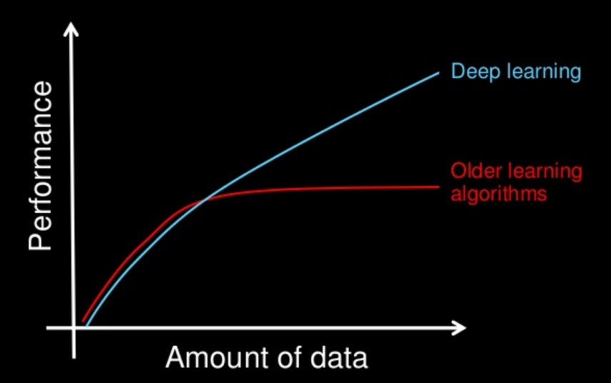
>
> 
<i>source</i>: <a href="https://www.slideshare.net/ExtractConf">Andrew Ng</a>, all rights reserved.

>
{: .callout}

# What is a neural network?

As the "neural" part of their name suggests, neural networks are brain-inspired systems. They  are 
intended to replicate the way humans learn. 

Neural networks consist of neurons that are highly interconnected.

## A neuron

A neuron is a unit which takes n entries and produce one unique output:

- Inputs can  come from other neurons or data input. 
The data can be binary, integers or real (floating point) values. If a symbolic
or nominal variable occurs, this must first be encoded with a set of
binary variables. For instance, a nominal variable of three alternatives
{blue, grey, brown} could be encoded, e.g, with {0,1,2}. 

- Each entry has a "weight"

- The neuron multiplies each of these inputs by a
weight. Then it adds the multiplications and passes the sum to an
activation function. Some neural networks do not use an activation
function (their principle is different). 

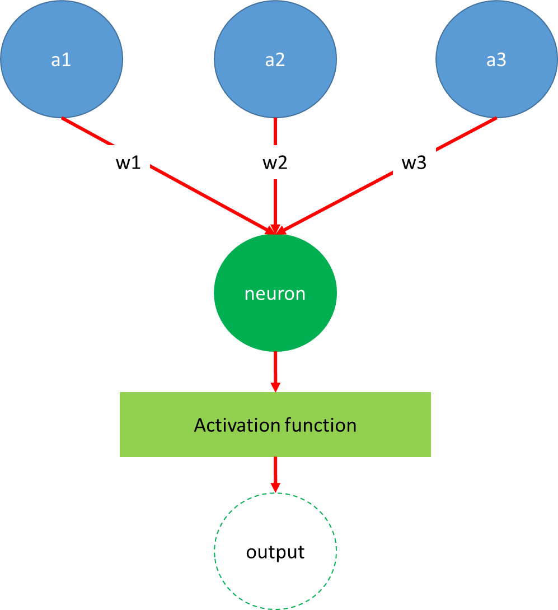

Where **f** denotes the activation function, **ai** one input (*N* being the number of inputs) and
**wi** is the corresponding weight. 

Let's implement a single neuron in Python. We need to define:

- entries 
- weights for each entries 
- an activation function.

We build a neuron with 4 entries and identity for the activation function.

~~~
import numpy as np

# set inputs
inputs = np.array([5, 1, 4, 8])

# set weights
weights = np.array([2, -1, 3, -2])

# Define a simple activation function
def f(x):
  return x

# Compute output
output = f(sum(weights.T*inputs))

print(output)  

~~~
{: .language-python}

~~~
5
~~~
{: .output}

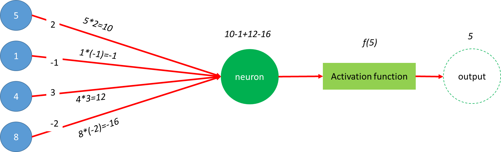

Different activation functions can be chosen when defining a neural network. 
The most popular activation functions is the *sigmoid* defined by the expression:

where *c* is a constant that can be selected arbitrarily.

When *c=1* we call it the **logistic activation function**.

We summarize the most common activation functions in the figure below:

> ## Generate the figure above:
>
> > ## Code
> > ~~~
> > import numpy as np
> > import matplotlib.pyplot as plt
> > import matplotlib.gridspec as gridspec
> > %matplotlib inline
> > 
> > 
> > plt.figure(figsize=(20,10))
> > 
> > def plot_activation(x,y,title, position):  
> >     ax = plt.subplot2grid((3, 3), position)                    
> >     ax.plot(x,y)
> >     if position[0]==2:
> >         ax.set_xlabel('Input')
> >     else:
> >         ax.set_xticklabels([])
> >     ax.set_title(title)
> >     ax.set_ylabel('Output');
> >                           
> > x = np.arange(-5, 5, 0.01)
> > 
> > # identity function
> > y=x
> > title='Identity'
> > plot_activation(x,y,title,(0,0))
> > 
> > # binary step
> > y =(x>=0)*1
> > title='Binary step'
> > plot_activation(x,y,title,(0,1))
> > 
> > # Logistic Activation Function
> > y = 1 / (1 + np.exp(-x))
> > title='Logistic'
> > plot_activation(x,y,title,(0,2))
> > 
> > # tanH function
> > y=np.tanh(x)
> > title='tanH'
> > plot_activation(x,y,title,(1,0))
> > 
> > # arcTan function
> > y = np.arctan(x)
> > title='ArcTan'
> > plot_activation(x,y,title,(1,1))
> > 
> > # Rectified Linear
> > y = (x>=0)*x
> > title='Rectified Linear'
> > plot_activation(x,y,title,(1,2))
> > 
> > # Parametric Rectified Linear Unit function
> > alpha=0.5
> > y = (x<0)*alpha*x + (x>=0)*x
> > title='PReLU'
> > plot_activation(x,y,title,(2,0))
> > 
> > # Exponential Linear Unit function
> > alpha=1
> > y = x*(x>=0) + (alpha*(np.exp(x)-1))*(x<0)
> > title='ELU'
> > plot_activation(x,y,title,(2,1))
> > 
> > #  Linear
> > y = np.log(1+np.exp(x))
> > title='SoftPlus'
> > plot_activation(x,y,title,(2,2))
> >
> > ~~~
> {: .solution}
>
{: .challenge}

> ## Challenge
> 
> Change the activation function, choosing one from the figure above. 
>
{: .challenge}

As you can observe, the activation functions we have shown return values between [0,1].
As our outputs can take values outside this range, we usually add what is called a *bias*:

where *b* is the bias value.

> ## Challenge
> 
> Add a bias value of -2.5 to your neuron. 
>
> > ## Solution
> > 
> > ~~~
> > import numpy as np
> > 
> > 
> > # set inputs
> > inputs = np.array([5, 1, 4, 8])
> > 
> > # set weights
> > weights = np.array([2, -1, 3, -2])
> > 
> > bias = -2.5 
> > 
> > # Define a simple activation function
> > def f(x):
> >   return 1 / (1 + np.exp(-x))
> > 
> > # Compute output
> > output = f(sum(weights.T*inputs) + bias)
> > 
> > print(output)  
> > 
> > ~~~
> > {: .language-python}
> >
> {: .solution}
>
{: .challenge}

## From a neuron to neural networks

As previously mentioned, a neural network is composed of neurons that are highly interconnected.

However, neurons are organized by layers. A layer is nothing but a collection of neurons which 
take in inputs and provide outputs. Inputs to each of these neurons are processed through the 
activation functions assigned to the neurons and outputs of one layer become input of the next layer:

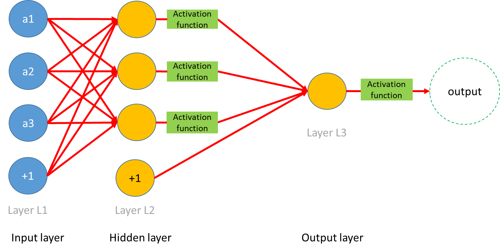

Layers between the input layer and the output layer are called *hidden layers*. The biases
values are set to 1 in the neural network shown above.

A neural network having more than one hidden layer is often referred to as a Deep Neural Network.
The designed neural network has a simple architecture. 

The information flows in one direction (inputs "travels" through hidden units, resulting in a vector of predictions). 

This is what we call **forward propagation**. 

We now need to give our neural network the ability to "learn" by choosing a learning algorithm. 

If we compare to their biological counterpart neural networks 
learn by example. To give a concrete example, we can consider a child that learns to 
recognize dogs from examples of "what a dog is" (typically pictures, drawings, movies, real dogs, etc.).

## Machine learning algorithms

We can broadly classify deep learning algorithms in 3 categories:

### Supervised Learning

- A target variable is predicted from a given set of predictors (independent variables).

- A function maps inputs to desired outputs.

- Each example in the training dataset needs to have a tag (right answer). 

- The training process continues until the model achieves a desired level of accuracy on the training data.

#### Usage

- Classification problems
- Regression problems
 
### Unsupervised Learning

- No target/outcome variable to predict/estimate.
- Data will be divided into clusters by similarity
	

#### Usage

- Clustering
- Reducing data dimensionality to compress the data while maintaining its structure and usefulness

> ## Tips
>
> - It’s not always easy show how well an unsupervised learning algorithm is performing. 
> "*Performance*" is often subjective and domain-specific.
> - Semi-supervised learning is used when a dataset is not entirely labeled (it is often very
> "expensive" to label large amount of data).
>
{: .callout}

### Reinforcement Learning

- Training to make specific decisions.
- Continually self-training using trial and error. 
- Learns from past experience and tries to capture the best possible knowledge to make accurate decisions. 

#### Usage

- Game playing
- Control problems (robotics, navigation, etc.)

# Supervised neural networks

Most common neural networks use supervised learning rules that modify the weights of the connections 
according to the input patterns that they are presented with.

When a neural network is initially presented with a "pattern" it makes a random
 "guess" as to what it might be. It then "sees" how far its answer was from the actual one 
 and makes an appropriate adjustment to its connection weights. 

The learning process occurs with each cycle or "epoch" 
(i.e. each time the network is presented with a new input pattern) through a forward 
activation flow of outputs, and the backwards error propagation of weight adjustments. 

## Perceptron Learning Rule

We will build a simple neural network using the **Perceptron Learning Rule** to train it.

The Perceptron Learning Rule is an algorithm for adjusting the network weights
 by minimizing the difference between the actual (computed by the neural network) 
 and the desired outputs.
 
### Training algorithm

- Generate a training pair:
	- an input *x = [ x1 x2 … xn]*
	- a target output *ytarget* (known/desired value)
		
- Then present the network with *x* and generate an output *y*
- Compare *y* with *ytarget* to compute the error
- Adjust the weights to reduce the error
- Repeat multiple times until the error is "small" enough.
 
 
## Single layer perceptron: Rosenblatt’s initial perceptron

Let's take a concrete example using the single neural network similar to the first neural
network we have previously defined.

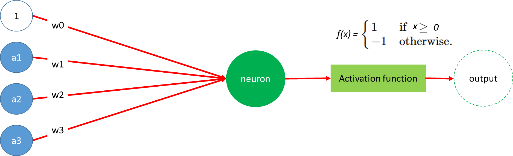

We have one bias cell (bias value is set to 1) and we use an alternative form of the 
unit step function:

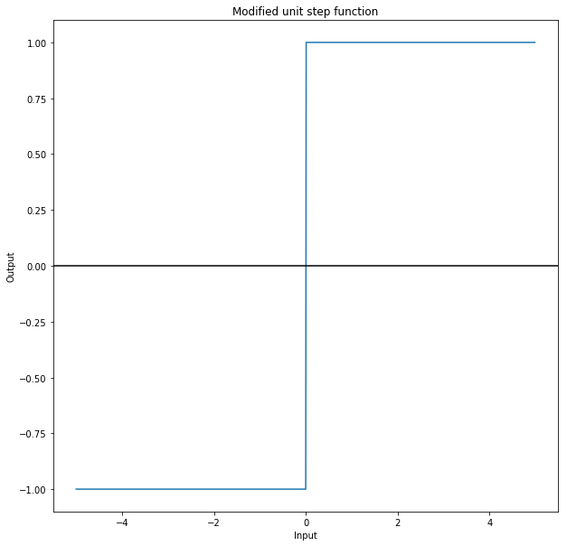

> ## Generate the figure above:
>
> > ## Code
> > ~~~
> > import numpy as np
> > import matplotlib.pyplot as plt
> > %matplotlib inline
> > 
> > x = np.arange(-5, 5, 0.01)
> > theta = 0
> > # modified unit step function
> > y =(x>=theta)*1 -1*(x<theta)
> > title='Modified unit step function'
> > plt.figure(figsize=(10,10))
> > plt.plot(x,y)
> > plt.xlabel('Input')
> > plt.title(title)
> > plt.ylabel('Output')
> > plt.axhline(0,color="black")
> >
> > ~~~
> {: .solution}
>
{: .challenge}

The idea behind is to mimic how a single neuron in the brain works. 
The perceptron receives multiple input signals, and if the sum of the input signals 
exceed a certain threshold it either returns a signal or remains “silent” otherwise. 

It allows to determine if an input belongs to one class or the other (1 or -1).

The first perceptron algorithm was published by [Frank Rosenblatt’s](https://fr.wikipedia.org/wiki/Frank_Rosenblatt) in 1957.

The perceptron algorithm is about learning the weights for the input signals in order to draw linear decision boundary that allows 
us to discriminate between the two linearly separable classes +1 and -1. 

Rosenblatt’s initial perceptron rule is fairly simple and can be summarized by the 
following steps:

- Initialize the weights to 0 or small random numbers.
- For each training sample
	- Calculate the output value.
	- Update the weights.
	
The output value is the class label predicted by the unit step function that we defined 
earlier (output =f(x)) and the weight update can be written as:

where

and η is the learning rate (a constant between 0.0 and 1.0), *ytarget* is the true value,
and the *y* is the predicted value.

Let's look at the algorithm a bit more carefully:

- If the predicted value *y* = *ytarget*:
    - *y* = *ytarget* = -1 then *ytarget* - *y*  = -1 - (-1) = 0
	- *y* = *ytarget* = 1 then *ytarget* - *y* = 1 - 1 = 0
	
	then 
	

	
Which means that we do not change the weights.
	
- if the predicted value *y* is different than *ytarget*:
	- *y* = -1 and *ytarget* = 1 then *ytarget* - *y* = 1 - (-1) = 2
thus 
	
	- *y* = 1 and *ytarget* = -1 then *ytarget* - *y* = -1 - 1 = -2
thus 
	

> ## Important
> 
> - All the weights are updated "simultaneously".
> - The convergence of the perceptron is only guaranteed if the two classes are linearly separable. If the two classes can’t be separated by a linear decision boundary, we can set a maximum number of passes over the training dataset (“epochs”) and/or a threshold for the number of tolerated misclassifications.
> 
{: .callout}

For our example where we have 3 inputs and one bias cell (=1), we write the update as:

Let's implement our training algorithm in Python:

~~~
import numpy as np

def train(x, y, eta, epochs):

    # initialize weights to 0
    weights = np.zeros(1 + x.shape[1])
    errors = []
    for i in range(epochs):
        error = 0
        for xi, target in zip(x, y):
            update = eta * (target - predict(xi, weights))
            # update input weights
            weights[1:] +=  update * xi
            # update bias weight
            weights[0] +=  update
            error += int(update != 0.0)
        errors.append(error)
    return weights,errors

def inputs(x, weights):
    return np.dot(x, weights[1:]) + weights[0]

# Forward propagation
def predict(x, weights):
    return np.where(inputs(x, weights) >= 0.0, 1, -1)
~~~
{: .language-python}

To apply our algorithm, we need to get a labeled dataset with 2 categories only (-1 and 1).

## Preparing dataset

**Cleaning and preparing data is a critical first step in any deep learning project.**

Understanding what contains your dataset and what can be achieved with it are two of the most important
tasks which should **never be neglected**.

- Examining the Dataset
- Narrowing down your columns (inputs)
- Deciding on what you want to get from your neural network (target Columns)
- Preparing the features for deep learning (filtering, handling of missing values, normalization) 

During the first part of this tutorial, we will be using datasets that have been already prepared for
deep learning. For practicing purposes, we strongly suggest to use fully validated ("sample") datasets; 
you can find a large number of freely available datasets at [UCI Machine Learning Repository](https://archive.ics.uci.edu/ml/index.php). 

# Overall code layout

- **Preprocessing** for getting data into shape
- **Training and selecting** a predictive model
- **Evaluating** models and predicting unseen data instances

For our example, we will load the [Iris dataset](https://archive.ics.uci.edu/ml/datasets/iris)
 from the [UCI Machine Learning Repository](https://archive.ics.uci.edu/ml/index.php) and 
 only focus on the two flower species *[Setosa](https://en.wikipedia.org/wiki/Iris_setosa)* and *[Versicolor](https://en.wikipedia.org/wiki/Iris_versicolore)*. 

<i>Iris setosa</i>

<i>Iris Versicolor</i>

  
 
 In addition, we will only use the two features *sepal length* and *petal length* as inputs.

A quick look into the [data](https://archive.ics.uci.edu/ml/machine-learning-databases/iris/iris.data) 
shows that if we only want to tackle *Setosa* and *Versicolor* flower species, we need to take
the first 100 rows:

~~~
import pandas as pd
df = pd.read_csv('https://archive.ics.uci.edu/ml/machine-learning-databases/iris/iris.data', header=None)

print(df)

# Attribute Information:
#   0. sepal length in cm
#   1. sepal width in cm
#   2. petal length in cm
#   3. petal width in cm
#   4. class:   
#      -- Iris Setosa
#      -- Iris Versicolour
#      -- Iris Virginica
        
# Prepare dataset for our neural network:
# Class (Setosa or Versicolor)
y = df.iloc[0:100, 4].values
# If it is not Setosa then it is Versicolor
y = np.where(y == 'Iris-setosa', -1, 1)

# Features (sepal length and petal length)
x = df.iloc[0:100, [0,2]].values
~~~
{:. .language-python}

And finally, we are ready to apply our neural network to our dataset!

~~~
import matplotlib.pyplot as plt
%matplotlib inline

eta = 0.1

# make 10 iterations
epochs = 10

[weights, errors] = train(x, y, eta, epochs)
print('Weights: %s' % weights)
plt.scatter(df.iloc[0:100, 0],df.iloc[0:100, 2], c=y)
plt.title('Perceptron')
plt.xlabel('sepal length [cm]')
plt.ylabel('petal length [cm]')
plt.show()

plt.plot(range(1, len(errors)+1), errors, marker='o')
plt.xlabel('Iterations')
plt.ylabel('Misclassifications')
plt.show()
~~~
{: .langage-python}

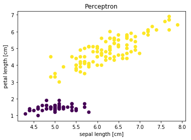

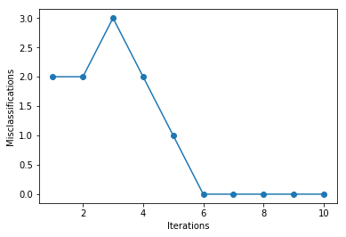

> ## Challenge
>
> Use the same neural network but focus on the flower species *versicolor* and 
> *[virginica](https://en.wikipedia.org/wiki/Iris_virginica)* i.e. select rows
> from 50 to 150.  
>
> - What is happening?
> - Compute the percentage of misclassification i.e.
>  (y != predict(x, weights)).sum())
> - Does it help to increase the number of iterations (*epochs*)?
> - What does it change when you reduce the training rate η?
> - Why?
>
> > ## Solution
> > 
> > epoch = 25; eta = 0.001
> > 
> > 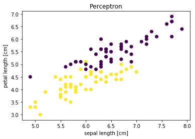
> > 
> > 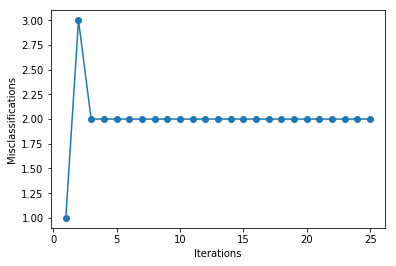
> > The percentage of misclassification is about 50% and increasing the
> > number of iterations does not help!
> > Convergence is one of the biggest problems of the perceptron. 
> > Frank Rosenblatt proofed mathematically that the perceptron learning rule converges 
> > if the two classes can be separated by linear hyperplane, but problems arise if the 
> > classes cannot be separated perfectly by a linear classifier. 
> {: .solution}
>
{: .challenge}

## Back propagation learning rule

 
**Backpropagation** is an abbreviation for the backward 
propagation of error. 

**The backpropagation algorithm** looks for the **minimum** of the error function
in weight space using the method of **gradient descent**. The combination of
weights which minimizes the error function is considered to be a solution of
the learning problem. 

Since this method requires computation of the gradient of the error function at each 
iteration step, we must guarantee the continuity and differentiability of the error function. 

Therefore, we cannot use the step function or any of its variant used in perceptrons.

Instead, we will be using a sigmoid:

~~~
# Sigmoid Function
def sigmoid (x):
     return 1/(1 + np.exp(-x))
~~~
{: .language-python}

The derivative of the sigmoid with respect to x is: 

### Cost function

Being able to specify the derivative of the cost function allows us to define a cost 
function *J(w)* that we can minimize in order to update our weights. 
In the case of the linear activation function, we can define the cost function *J(w)* 
as the sum of squared errors, which is similar to the cost function that is minimized 
in ordinary least squares linear regression.

### Gradient descent

To minimize this cost function, we will use the gradient descent method.

Let's illustrate it for one dimensional case, as shown in the figure below:

Source: <a href="http://prog3.com/sbdm/blog/google19890102/article/details/50276775">http://prog3.com/sbdm/blog/google19890102/article/details/50276775</a>

If the current point of the slope (gradient) is positive, then choose the direction to the 
left, if the current slope (gradient) is negative, then the direction of the gradient is to 
the right.

See [Gradient Descent](https://en.wikipedia.org/wiki/Gradient_descent) for more about gradient descent.

At each iteration, a step into the opposite direction of the gradient is taken i.e.

∇ is the gradient.
 
thus, we have to compute the partial derivative of the cost function for each weight in 
the weight vector: 

Let compute it for one weight:

Thus our learning rule becomes:

We can then update the weights:

This learning rule looks identical to the perceptron rule:

- here the output *y* can be a real number and not only a class label as in the perceptron rule.
- the weight update is based on all samples in the training set (instead of updating the 
weights incrementally after each sample).

Let's implement the backpropagation rule in python, by modifying our previous neural network:

~~~
import numpy as np

def train(x, y, eta, epochs):

    weights = np.zeros(1 + x.shape[1])
    costs = []

    for i in range(epochs):
        output = inputs(x, weights)
        errors = (y - output)
        weights[1:] += eta * x.T.dot(errors)
        weights[0] += eta * errors.sum()
        cost = (errors**2).sum() / 2.0
        costs.append(cost)
    return weights,costs

def inputs(x, weights):
        return np.dot(x, weights[1:]) + weights[0]

def activation(x, weights):
    return inputs(x, weights)

def predict(x, weights):
    return np.where(activation(x, weights) >= 0.0, 1, -1)

~~~
{: .language-python}

This algorithm strongly depends on the learning rate and it often necessary to try different
values to find a good learning rate for optimal convergence.

So let's plot the cost for two different learning rates *0.01* and *0.0001*:

~~~
epochs=10
eta=0.01

[weights, costs] = train(x, y, eta, epochs)
plt.plot(range(1, len(costs)+1), np.log10(costs), marker='o')
plt.xlabel('Iterations')
plt.ylabel('log(sum_squared_error)')
plt.title('Learning rate '+ str(eta))
plt.show()

eta=0.0001

[weights, costs] = train(x, y, eta, epochs)
plt.plot(range(1, len(costs)+1), np.log10(costs), marker='o')
plt.xlabel('Iterations')
plt.ylabel('log(sum_squared_error)')
plt.title('Learning rate ' + str(eta))
plt.show()

~~~
{: .language-python}

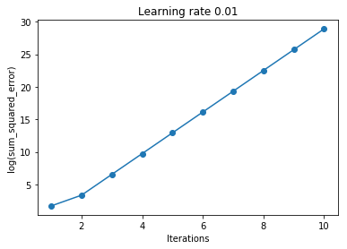

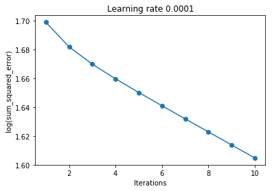

As you can see from the figures above, using a learning rate of *0.01* does not offer proper
convergence while with *0.0001*, the algorithm converges quickly.

The two plots illustrate problems related to the gradient descent:

- If the learning rate is too large, gradient descent will overshoot the minima and diverge.
- On the other hand, if the learning rate is too small, the algorithm will require too many epochs to converge
 and can become trapped in local minima more easily.

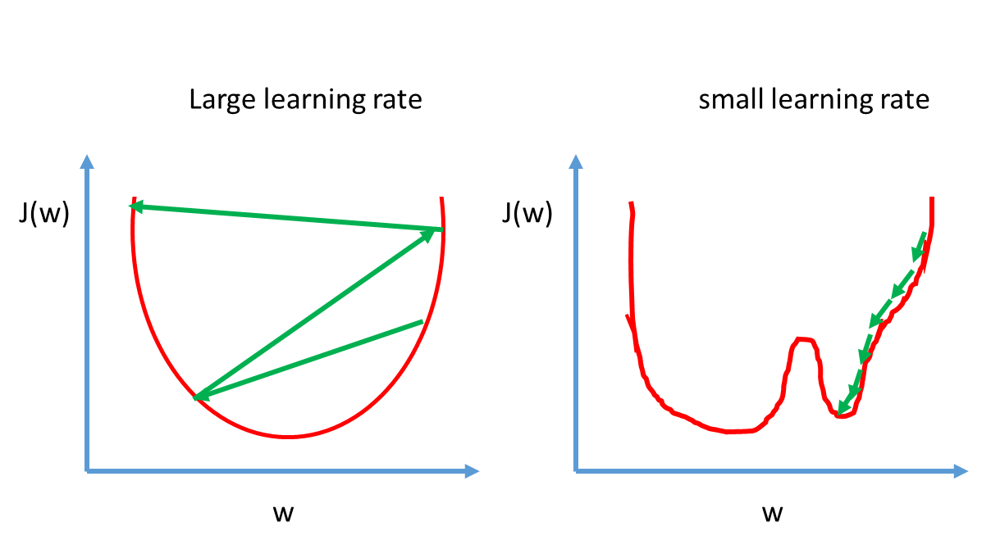

### Standardization of input data

It is (generally) easier to find an appropriate learning rate if the input values are on the same scale. 
In addition, it often leads to faster convergence and can prevent the weights from becoming 
too small (numerical stability).

A common way of feature scaling is standardization:

where 

is the mean value of xj and 

is the standard deviation.

And let's apply it to the same iris dataset as before but this time, we standardize the inputs:

~~~
import pandas as pd
df = pd.read_csv('https://archive.ics.uci.edu/ml/machine-learning-databases/iris/iris.data', header=None)

# setosa and versicolor
y = df.iloc[0:100, 4].values
y = np.where(y == 'Iris-setosa', -1, 1)

# sepal length and petal length
x = df.iloc[0:100, [0,2]].values

# normalize inputs
x_std = np.copy(x)
x_std[:,0] = (x[:,0] - x[:,0].mean()) / x[:,0].std()
x_std[:,1] = (x[:,1] - x[:,1].mean()) / x[:,1].std()
~~~
{: .language-python}

Now that our inputs are normalized, let's run our neural network:

~~~
epochs=15
eta=0.01

# initialize weights to 0
weights = np.zeros(1 + x.shape[1])
costs = []

[weights, costs] = train(x_std, y,  eta, epochs)

plt.plot(range(1, len(costs)+1), costs, marker='o')
plt.xlabel('Iterations')
plt.ylabel('Sum-squared-error')
plt.show()

plt.scatter(x[:,0],x[:,1], c=predict(x_std, weights))
plt.title('Perceptron')
plt.xlabel('sepal length [cm]')
plt.ylabel('petal length [cm]')
plt.show()

~~~
{: .language-python}

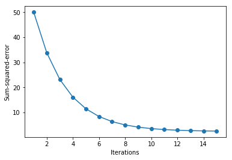
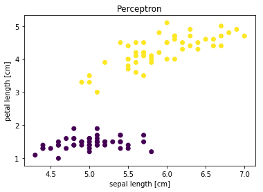

## Multi-layered neural network

Finally, as a last example, let's consider a multi-layered neural network.

As in our previous example, we use a sigmoid for the activation function.

~~~
## Neural network with numpy for regression
import numpy as np
#Input array
X=np.array([[1,0,1,0],[1,0,1,1],[0,1,0,1]])
#Output
y=np.array([[1],[1],[0]])

#Sigmoid Function
def sigmoid (x):
     return 1/(1 + np.exp(-x))

#Derivative of Sigmoid Function
def sigmoid_derivative(x):
     return x * (1 - x)

# initialization of parameters
epoch=5000 #amount of training iterations
lr=0.1 #Setting learning rate
inputlayer_neurons = X.shape[1] #number of features in data set
hiddenlayer_neurons = 3 #number of neurons in the hidden layer
output_neurons = 1 #number of neurons at output layer

#weight and bias initialization
wh=np.random.uniform(size=(inputlayer_neurons,hiddenlayer_neurons))
bh=np.random.uniform(size=(1,hiddenlayer_neurons))
wout=np.random.uniform(size=(hiddenlayer_neurons,output_neurons))
bout=np.random.uniform(size=(1,output_neurons))

for i in range(epoch):
#Forward Propagation
    hidden_layer_input1=np.dot(X,wh)
    hidden_layer_input=hidden_layer_input1 + bh
    hiddenlayer_activations = sigmoid(hidden_layer_input)
    output_layer_input1=np.dot(hiddenlayer_activations,wout)
    output_layer_input= output_layer_input1+ bout
    output = sigmoid(output_layer_input)

  #Backpropagation
    E = y-output
    slope_output_layer = sigmoid_derivative(output)
    slope_hidden_layer = sigmoid_derivative(hiddenlayer_activations)
    d_output = E * slope_output_layer
    Error_at_hidden_layer = d_output.dot(wout.T)
    d_hiddenlayer = Error_at_hidden_layer * slope_hidden_layer
    wout += hiddenlayer_activations.T.dot(d_output) *lr
    bout += np.sum(d_output, axis=0,keepdims=True) *lr
    wh += X.T.dot(d_hiddenlayer) *lr
    bh += np.sum(d_hiddenlayer, axis=0,keepdims=True) *lr

print('actual :\n', y, '\n')
print('predicted output :\n', output)
~~~
{: .language-python}

# Examples

- [Deep neural network with numpy mask arrays](https://github.com/anacost/project2-FYS-STK4155)

> ## Challenge
>
> - Is it correct to take all the samples for the training dataset?
> - How can we validate our neural network?
> 
>  Discuss with your neighboor about a better strategy and try to implement it with our
> single-layer backpropagation neural network.
> 
> > ## Solution
> >
> > we can split our input data in two parts:
> > - training dataset
> > - test/validation dataset
> > The split can be random.
> {: .solution}
>
{: .challenge}



