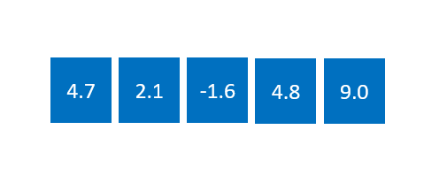
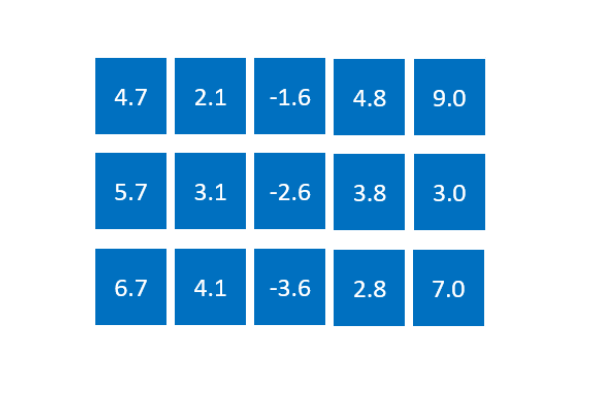
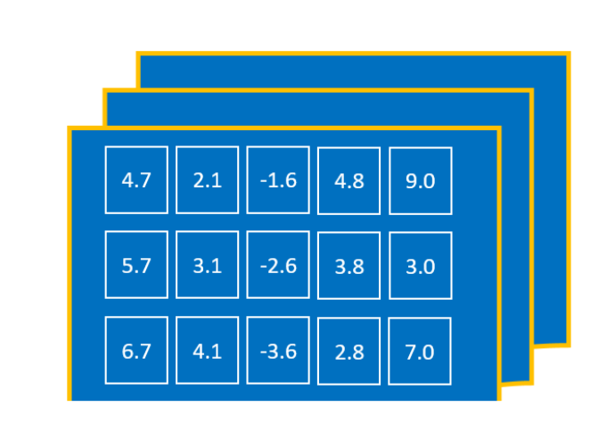
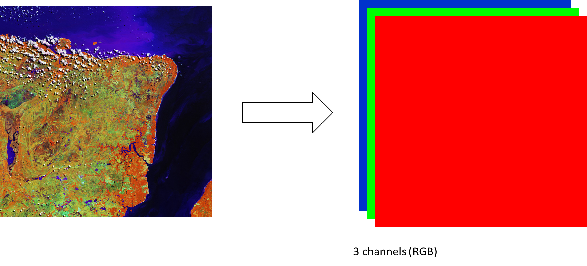
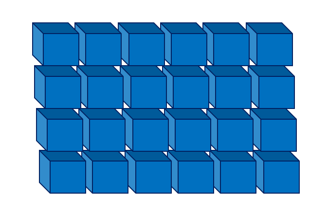
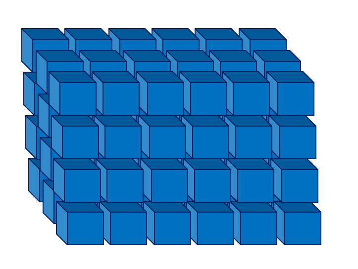
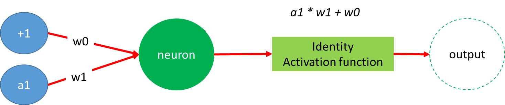

# Deep learning frameworks

It was worth taking some time to look inside and understand underlying concepts of neural 
networks but as we have experienced, writing neural networks with Python using 
[numpy](http://www.numpy.org/) or any other "low-level" user interface is a bit cumbersome, 
especially when hidden layers are involved. 

For your research work, you will be mostly likely using high-level frameworks like Keras, 
TensorFlow or PyTorch. They will allow us to build very complex models quickly. 

## Most common high-level frameworks for deep learning

- [TensorFlow](https://www.tensorflow.org/) 
- [Theano](http://deeplearning.net/software/theano/)
- [Keras](https://keras.io/)
- [Torch](https://pytorch.org/)
- [Caffe](http://caffe.berkeleyvision.org/)

> ## Tips
> For more information see [presentation from Konstantin Shmelkov, Pauline Luc, Thomas Lucas, Vicky Kalogeiton, Stéphane Lathuilière on 
> Deep learning libraries](http://project.inria.fr/deeplearning/files/2016/05/DLFrameworks.pdf).
>
{: .callout}

### Which framework to choose when ..?

To choose, one need to look at:

- Code development (is it active?, what is the policy to release new versions, etc.)
- Performance (GPU/multi-GPU support, etc.)
- Installation/deployment (how difficult is it to install/test/deploy, etc.)
- **Community and documentation**

So why choosing [pyTorch](https://pytorch.org)?

- Flexibility
	- Easy to extend - at any level, thanks to easy integration with C
		- Result :
			- whatever the problem, there is a package.
			- new generic bricks are often very rapidly implemented by the community and are easy to pull
	- Imperative (vs declarative); more info at [Deep learning programming style](https://mxnet.apache.org/api/architecture/program_model).
	- Typical use case : write a new layer, with GPU implementation :
		a. Implement for CPU nn
		b. Implement for GPU cunn
		c. Test (jacobian and unit testing framework)
- Readability
- Modularity
- Speed (including [multi-GPU support](https://pytorch.org/tutorials/beginner/former_torchies/parallelism_tutorial.html)
- Documentation is overall very good and the community is growing:
	- [Pytorch documentation](https://pytorch.org/docs/stable/index.html)
	- [Tutorials](https://pytorch.org/tutorials/)
	- [Examples](https://github.com/pytorch/examples)
	- [pytorch slack channel](https://pytorch.slack.com/) (send an email to slack@pytorch.org to get access)
	- [PyTorch discussions](https://discuss.pytorch.org/)
	- [Report bugs, request features, discuss issues and more](https://github.com/pytorch/pytorch)
	- [free online course with fast.ai](https://www.fast.ai/)

In short, **PyTorch is a good framework for research**.

# Introduction to PyTorch

> ## Credits
> This lesson is taken from [Deep learning with PyTorch: a 60 minute blitz](https://pytorch.org/tutorials/beginner/deep_learning_60min_blitz.html).
>
{: .callout}

## Tensors and variables

> ## Tips
> This short introduction is for PyTorch; however many of the notions discussed below apply 
> to other high-level frameworks (tensorflow, etc.).
>
{: .callout}

Most high-level deep learning frameworks will introduce the notion of *[tensors](https://en.wikipedia.org/wiki/Tensor)*:

<b>Tensors = building blocks (data container)</b>

When using PyTorch, Tensors are similar to [NumPy’s ndarrays](https://docs.scipy.org/doc/numpy-1.15.0/reference/generated/numpy.ndarray.html),
with the addition being that Tensors can also be used on a GPU to accelerate computing.

Let's try to visualize what are tensors:

### 0D Tensors

<b>0D tensor = scalar</b>

A scalar is a single element such as a number *1*, *4.7*, etc. 

With numpy, we could write:

~~~
import numpy
x = np.array(4.7)
print(x)
~~~
{: .language-python}

with PyTorch:

~~~
import torch
x = torch.tensor(4.7)
print(x)
~~~
{: .language-python}

~~~
tensor([4.7000])
~~~
{: .output}

You can also define an uninitialized tensor, or fill it with zeros or initialize it with random values:

~~~
# with empty, you need to give the dimension of the tensor
# here we define a tensor with one element
x = torch.empty(1)

# Same if initializing with zeros;
# one can also add the type of tensor: here long integers
x = torch.zeros(1, dtype=torch.long)

# uniform random numbers
x = torch.rand(1)
~~~
{: .language-python}

> ## Note
>
> Random sampling creation include: 
> - torch.rand() 
> - torch.rand_like() 
> - torch.randn() 
> - torch.randn_like() 
> - torch.randint() 
> - torch.randint_like() 
> - torch.randperm() You may also use torch.empty() 
> See [random sampling](https://pytorch.org/docs/stable/torch.html#random-sampling)
>
{: .callout}

### 1D tensors

<b>1D tensor = vector</b>

~~~
x = torch.tensor([4.7, 2.1, -1.6, 4.8, 9.0])
~~~
{: .language-python}

~~~
tensor([4.7000, 2.1000, -1.6000, 4.8000, 9.0000])
~~~
{: .output}

### 2D tensors

<b>2D tensor = matrix</b>

~~~
x = torch.tensor([[4.7, 2.1, -1.6, 4.8, 9.0],
		[5.7, 3.1, -2.6, 3.8, 3.0], 
		[6.7, 4.1, -3.6, 2.8, 7.0] ])
~~~
{: .language-python}

~~~
tensor([[4.7000, 2.1000, -1.6000, 4.8000, 9.0000],
	[5.7000, 3.1000, -2.6000, 3.8000, 3.0000], 
	[6.7000, 4.1000, -3.6000, 2.8000, 7.0000] ])
~~~
{: .output}

If we go back to our [Iris dataset](https://archive.ics.uci.edu/ml/datasets/iris), we could
easily load our dataset into a 2D Pytorch tensor:

~~~
import pandas as pd
df = pd.read_csv('https://archive.ics.uci.edu/ml/machine-learning-databases/iris/iris.data', header=None)

# sepal length and petal length
x = torch.tensor(df.iloc[0:100, [0,2]].values)
# as for a numpy array, you can get the dimensions of x
print(x.size())
# you can select section of your tensor:
print(x[1:4,1])
~~~
{: .language-python}

If you select one element then you can use `.item()` to get a scalar (not a tensor anymore):

~~~
x[1,1].item()
~~~
{: .language-python}

### 3D tensors

<b>3D tensor = cube</b>

~~~
x = torch.rand(2,3,6)
print(x)
print(x.size())
~~~
{: .language-python}

Typically, we can use 3D tensors to represent timeseries or colored images (spatial variables, color).

#### Example

**Image: Copernicus Sentinel-2A satellite captures northern Brazil's Marajó island**

*Source*: [https://phys.org/news/2018-01-image-copernicus-sentinel-2a-satellite-captures.html](https://phys.org/news/2018-01-image-copernicus-sentinel-2a-satellite-captures.html)

Sentinel-2 images Earth are available with 13 spectral channels. Scientists can select which wavelength combinations to process over a given area to help better understand targets on the ground.

Read more at: [https://phys.org/news/2018-01-image-copernicus-sentinel-2a-satellite-captures.html#jCp](https://phys.org/news/2018-01-image-copernicus-sentinel-2a-satellite-captures.html#jCp)

In the example, we chose 3 channels; one for each color (R,G,B).

### 4D tensors

<b>4D tensor = vector of matrices</b>

~~~
x = torch.rand(2,3,6,2)
print(x)
print(x.size())
~~~
{: .language-python}

We can use 4D tensors for instance for videos:

- spacial variables/color/time
- spacial variables/depth/time

*Source* : [http://clivebest.com/blog/?p=6843](http://clivebest.com/blog/?p=6843)

### 5D tensors

<b>5D tensor = matrix of matrices</b>

~~~
x = torch.rand(2,3,6,2,3)
print(x)
print(x.size())
~~~
{: .language-python}

### 6D tensors

<b>6D tensor = cube of matrices</b>

~~~
x = torch.rand(2,3,6,2,3,3)
print(x)
print(x.size())
~~~
{: .language-python}

For a more formal [Introduction to Tensors for Students of Physics and Engineering](https://www.grc.nasa.gov/www/k-12/Numbers/Math/documents/Tensors_TM2002211716.pdf).

## Basic operations

See [PyTorch Basic operations](https://jhui.github.io/2018/02/09/PyTorch-Basic-operations/).

### conversion to numpy

~~~
x = torch.rand(2,3)
print(x)
print(x.numpy())
~~~
{: .language-python}

## Automatic differentiation for building and training neural networks (Autograd)

The autograd package provides automatic differentiation for all operations on Tensors. 

As we have seen in [our previous lesson](../01-introduction/index.html), it is central to the 
backpropagation learning algorithm.

To activate autograd, you need to add `requires_grad=True` when defining your tensor:

~~~
x = torch.rand(2,3,requires_grad=True)
print(x)
~~~
{: .language-python}

 When setting `.requires_grad = True`, PyTorch tracks all operations on your tensor. 
 Once all your computations are done, you can then call .backward() and PyTorch will give
you all the gradients computed automatically. Use `.grad` attribute to get the gradient values:

~~~
x = torch.rand(2,3,requires_grad=True)
y = x*x + 5
out = y.sum()
out.backward()
print(x.grad)
~~~
{: .language-python}
 
Learn more about autograd with [PyTorch documentation](https://pytorch.org/tutorials/beginner/blitz/autograd_tutorial.html#sphx-glr-beginner-blitz-autograd-tutorial-py).

## Creating a simple Neural network with PyTorch

To create a neural network with PyTorch, you have to use the 
[Pytorch neural network class](https://pytorch.org/docs/stable/nn.html) and
create a new class based on [torch.nn.Module](https://pytorch.org/docs/stable/nn.html) 
which is the base class for all PyTorch neural networks.

> ## Note
>
> - Don't be afraid by the terminology!
> - Even though the word "class" may be new to you, if you are a python programmer
> you most likely used classes (without even knowing it).
> - Let's go back to our iris dataset:
> ~~~
> import pandas as pd
> df = pd.read_csv('https://archive.ics.uci.edu/ml/machine-learning-databases/iris/iris.data', header=None)
> print(type(df))
> ~~~
> {: .language-python}
> 
> In the example above, we read our iris dataset and stored it in a variable `df`.
> The type of `df` is `pandas.core.frame.DataFrame`. 
> Looking at the pandas [DataFrame](https://pandas.pydata.org/pandas-docs/version/0.23.4/generated/pandas.DataFrame.html)
> documentation, we can get the list of attributes for a DataFrame and the list of methods
> we can use for a DataFrame.
> For instance, we can use `describe` to get a summary of our data:
>
> ~~~
> df.describe()
> ~~~
> {: .language-python}
>  Or you can sort your data depending on the column 1:
>
> ~~~
> df.sort_values(by=1)
> ~~~
> {: .language-python}
>
> Here you are! Without knowing it you used python classes!
>
{: .callout}

### The neural network class `torch.nn.Module`

Neural networks can be constructed using the `torch.nn` package.
`nn` depends on autograd to define models and differentiate them. 
An `nn.Module` contains layers, and a method `forward(input)` that returns the `output`.

To define a neural network with PyTorch, you would need to define a new class inherited from 
`nn.Module`. 

Let's take a very simple example i.e. we will create a perceptron with one single linear 
neuron and one single output. The activation function is the identity activation function.

We will define a new class called perceptron (1 single linear neuron)

~~~
import torch

class Perceptron(torch.nn.Module):
    def __init__(self):
	    # We initialize using the base 
		# class initialization
		# super() lets you avoid referring to the base class explicitly.
        super().__init__()
		# we define a layer using Linear model
		# as we will apply a linear transformation to our inputs
		# the first parameter is the number of neurons in the input layer
		# and the second parameter is the number of outputs (here 1).
        self.fl = torch.nn.Linear(1,1)
	
    def forward(self, x):
        x = self.fl(x)
        return x
~~~
{: .language-python}

> ## Help: what do you mean by *inherited*?
>
> 
> 
> *Character class* is a **base class** and *Letter class* and *Digit class* inherited from
> this base class. 
>
{: .callout}

What we have done so far is to "describe" the layout of our neural network. Now, we can
define a variable of type Perception:

~~~
neural_network = Perceptron()
print(neural_network)
~~~
{: .language-python}

~~~
Perceptron(
  (fl): Linear(in_features=1, out_features=1, bias = True)
)
~~~ 
{: .output}

We can also ask for information about the Perceptron parameters:
~~~
print(list(neural_network.parameters()))
~~~
{: .language-python}

~~~
Parameter containing:
tensor([[0.3606]], requires_grad = True), Parameter containing:
tensor([-0.3389], requires_grad=True)
~~~ 
{: .output}

It means, *w0* is set to *-0.3389* (bias value) and *w1* = 0.3606.

So if we run our neural network in *forward* mode, we should compute:

~~~
a1*w1 + w0
~~~
{: .language-latex}

Let's create a single input value:

~~~
input = torch.randn(1, requires_grad=True)
print(input)
~~~
{: .language-python}

~~~
tensor([-1.7248], requires_grad=True)
~~~
{: .output}

Then we can use this input through the unlearned network:

~~~
out = neural_network(input)
print(out)
~~~
{: .language-python}

~~~
tensor([-0.9608], requires_grad=True)
~~~
{: .output}

And it is correct because we get:

~~~
a1*w1 + w0 = 0.3606 * (-1.7248) + (-0.3389) = -0.96086288
~~~
{: .language-latex}

### Training the network

To train our network, we will define a cost function and use a gradient descent method similar
to what we have done previously:
 
~~~
cost_function = torch.nn.MSELoss()
   
perceptron_optimizer = torch.optim.SGD(neural_network.parameters(), lr=0.01)
~~~
{: .language-python}

`torch.nn.MSELoss()` creates a criterion that measures the mean squared error 
(squared L2 norm) between each element in the modeled and targeted y. You can use other cost
functions either by defining a new function yourself or by using one of the predefined.

**SGD** stands for *[Stochastic Gradient Descent](https://en.wikipedia.org/wiki/Stochastic_gradient_descent)* 
and is the de-facto gradient descent method in PyTorch. However, other methods are available too.

See PyTorch documentation [here](https://pytorch.org/docs/stable/optim.html).

Then we can train our neural network. For training our neural network, we need to define
input data. Let's take a very simple function y = 3*x:

~~~
inputs = [(1.,3.), (2.,6.), (3.,9.), (4.,12.), (5.,15.), (6.,18.)]
for epoch in range(100):
    for i, data in enumerate(inputs):
        X, Y = iter(data)
        X = torch.tensor([X], requires_grad=True)
		# output does not need to have requires_grad=True
        Y = torch.tensor([Y], requires_grad=False)
		# Initialize optimizer
        perceptron_optimizer.zero_grad()
        outputs = neural_network(X)
        cost = cost_function(outputs, Y)
        cost.backward()
        perceptron_optimizer.step()
        if (i % 10 == 0):
            print("Epoch {} - loss: {}".format(epoch, cost.item()))

~~~
{: .language-python}

### Testing the network

~~~
import numpy as np
import matplotlib.pyplot as plt
plt.figure(figsize=(10,10))

data = torch.zeros(6,1)
for i in range(6):
    plt.plot(i+1,(i+1)*3,marker='o', color='b')
    data[i] = float(i+1.)
#predict values
Y=neural_network(data)
plt.plot(range(1,7),Y.detach().numpy())
print(Y)
~~~
{: .language-python}

> ## Challenge
> 
> - Test your neural network with inputs values that were not used during the training.
> - Does it work?
>
{: .challenge}


