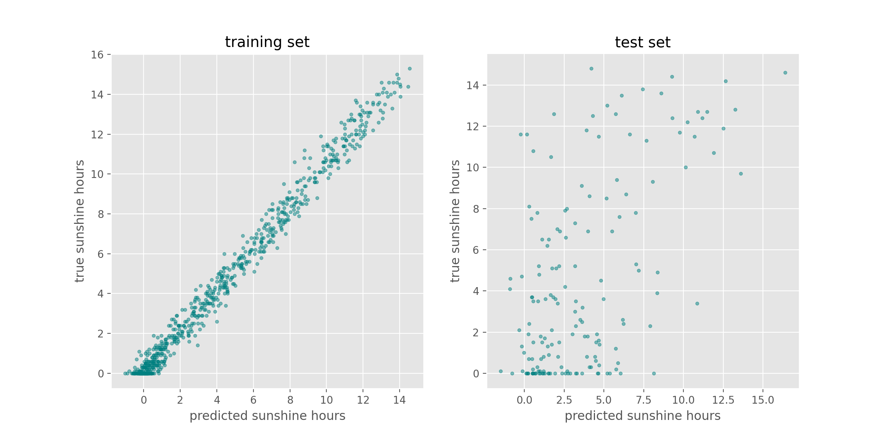
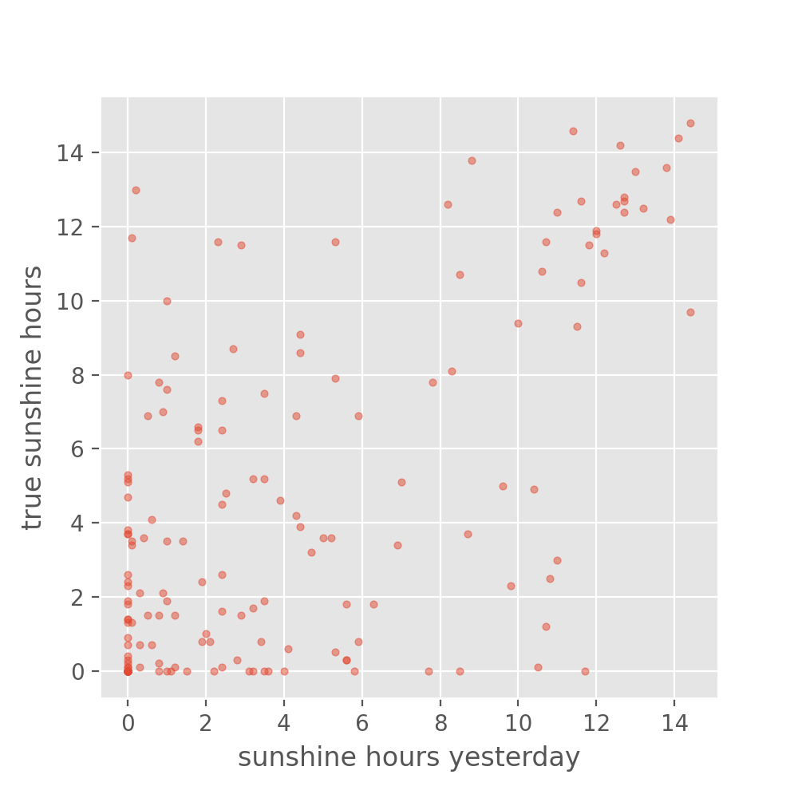
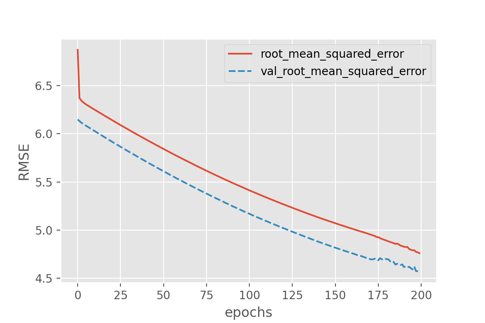
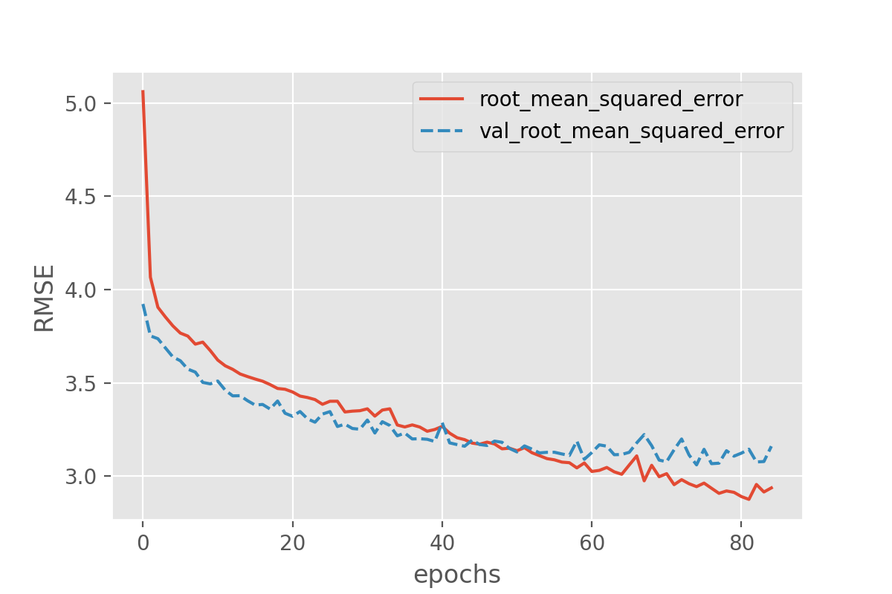
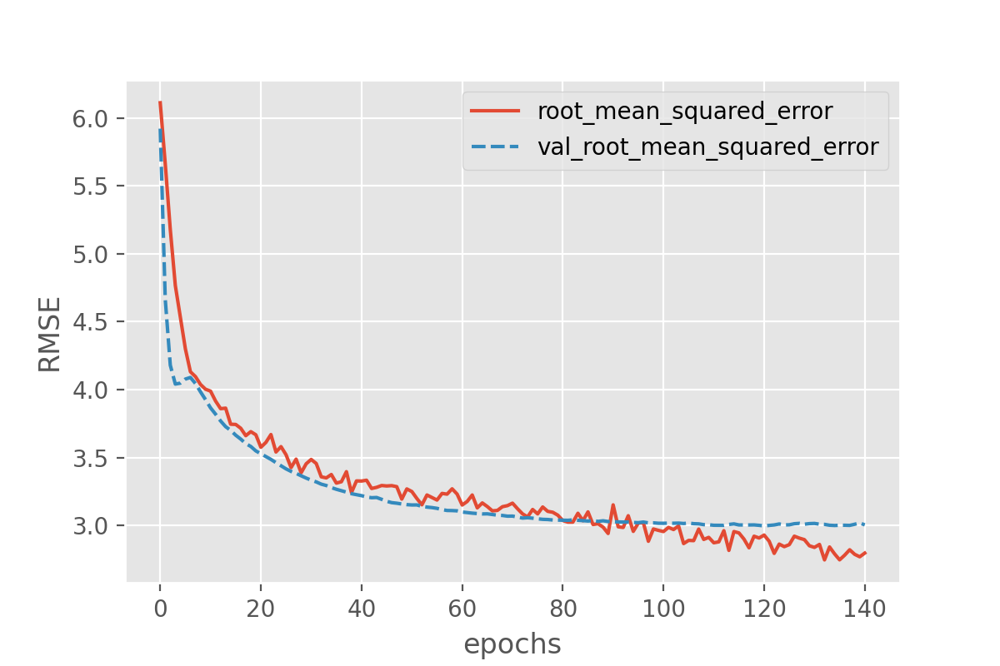
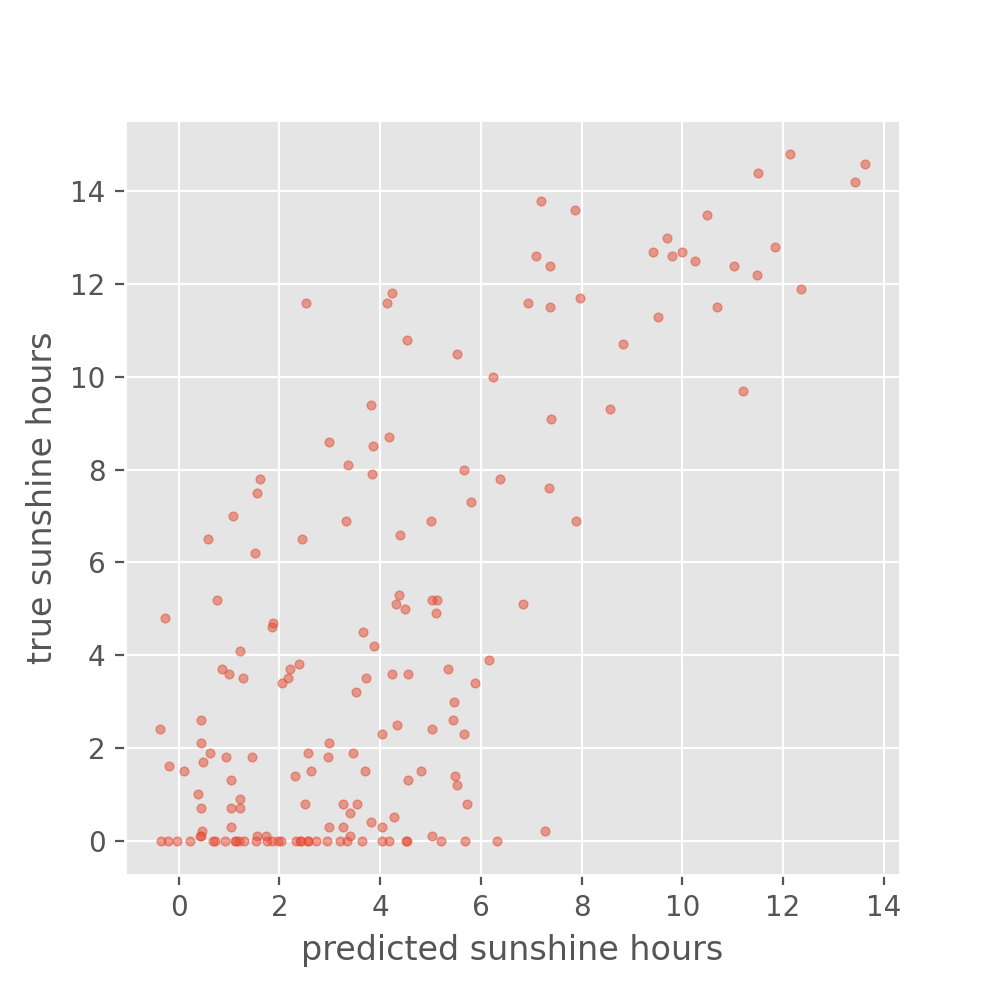

# Import & explore the data

### Import dataset
Here we want to work with the *weather prediction dataset* (the light version) which can be
[downloaded from Zenodo](https://doi.org/10.5281/zenodo.5071376).
It contains daily weather observations from 11 different European cities or places through the
years 2000 to 2010. For all locations the data contains the variables ‘mean temperature’, ‘max temperature’, and ‘min temperature’. In addition, for multiple of the following variables are provided: 'cloud_cover', 'wind_speed', 'wind_gust', 'humidity', 'pressure', 'global_radiation', 'precipitation', 'sunshine', but not all of them are provided for all locations. A more extensive description of the dataset including the different physical units is given in accompanying metadata file.

~~~
import pandas as pd

filename_data = "weather_prediction_dataset.csv"
data = pd.read_csv(filename_data)
data.head()
~~~
{:.language-python}

| | DATE 	| MONTH | 	BASEL_cloud_cover 	| 	BASEL_humidity 	| 	BASEL_pressure	| ... |
|------:|------:|---------------:|--------------:|------------------:|------------:|------------:|
|0| 	20000101 	|1 	|8 	|0.89 	|1.0286|... |
|1| 	20000102 	|1 	|8 	|0.87 	|1.0318|... |
|2| 	20000103 	|1 	|5 	|0.81 	|1.0314|... |
|3| 	20000104 	|1 	|7 	|0.79 	|1.0262|... |
|4| 	20000105 	|1 	|5 	|0.90 	|1.0246|... |
{: .output}

> ## Load the data
> If you have not downloaded the data yet, you can also load it directly from Zenodo:
> ~~~
> data = pd.read_csv("https://zenodo.org/record/5071376/files/weather_prediction_dataset_light.csv?download=1")
> ~~~
> {: .language-python}
{: .callout}

### Brief exploration of the data
Let us start with a quick look at the type of features that we find in the data.
~~~
data.columns
~~~
{:.language-python}

~~~
Index(['DATE', 'MONTH', 'BASEL_cloud_cover', 'BASEL_humidity',
       'BASEL_pressure', 'BASEL_global_radiation', 'BASEL_precipitation',
       'BASEL_sunshine', 'BASEL_temp_mean', 'BASEL_temp_min', 'BASEL_temp_max',
        ...
       'SONNBLICK_temp_min', 'SONNBLICK_temp_max', 'TOURS_humidity',
       'TOURS_pressure', 'TOURS_global_radiation', 'TOURS_precipitation',
       'TOURS_temp_mean', 'TOURS_temp_min', 'TOURS_temp_max'],
      dtype='object')
~~~
{:.output}

> ## Exercise: Explore the dataset
>
> Let's get a quick idea of the dataset.
>
> * How many data points do we have?
> * How many features does the data have (don't count month and date as a feature)?
> * What are the different measured variabel types in the data and how many are there (humidity etc.) ?
>
> > ## Solution
> > ~~~
> > data.shape
> > ~~~
> > {:.language-python}
> > This will give both the number of datapoints (3654) and the number of features (89 + month +
> date).
> >
> > To see what type of features the data contains we could run something like:
> > ~~~
> > print({x.split("_")[-1] for x in data.columns if x not in ["MONTH", "DATE"]})
> > ~~~
> > {:.language-python}
> > ~~~
> > {'precipitation', 'max', 'radiation', 'humidity', 'sunshine', 'min', 'pressure', 'mean', 'cover'}
> > ~~~
> > {:.output}
> > An alternative way which is slightly more complicated but gives better results is using regex.
> > ~~~
> > import re
> > feature_names = set()
> > for col in data.columns:
> >     feature_names.update(re.findall('[^A-Z]{2,}', col))
> >     
> > feature_names
> > ~~~
> > In total there are 9 different measured variables.
> {:.solution}
{:.challenge}

# Define the problem: Predict tomorrow's sunshine hours

### Select a subset and split into data (X) and labels (y)
The full dataset comprises 10 years (3654 days) from which we here will only select the first 3 years.
We will then define what exactly we want to predict from this data. A very common task with weather data is to make a prediction about the weather somewhere in the future, say the next day. The present dataset is sorted by "DATE", so for each row `i` in the table we can pick a corresponding feature and location from row `i+1` that we later want to predict with our model.
Here we will pick a rather difficult-to-predict feature, sunshine hours, which we want to predict for the location: BASEL.

~~~
nr_rows = 365*3
# data
X_data = data.loc[:nr_rows].drop(columns=['DATE', 'MONTH'])

# labels (sunshine hours the next day)
y_data = data.loc[1:(nr_rows + 1)]["BASEL_sunshine"]
~~~
{:.language-python}

# Prepare the data for machine learning
In general, it is important to check if the data contains any unexpected values such as `9999` or `NaN` or `NoneType`. You can use the using pandas `data.describe()` function for this. If so, such values must be removed or replaced.
In the present case the data is luckily well prepared and shouldn't contain such values, so that this step can be omitted.

### Split data and labels into training, validation, and test set

As with classical machine learning techniques, it is required in deep learning to split off a hold-out *test set* which remains untouched during model training and tuning. It is later used to evaluate the model performance. On top, we will also split off an additional *validation set*, the reason of which will hopefully become clearer later in this lesson.

To make our lives a bit easier, we employ a trick to create these 3 datasets, `training set`, `test set` and `validation set`, by calling the `train_test_split` method of `scikit-learn` twice.

First we create the training set and leave the remainder of 30 % of the data to the two hold-out sets.

~~~
from sklearn.model_selection import train_test_split

X_train, X_holdout, y_train, y_holdout = train_test_split(X_data, y_data, test_size=0.3, random_state=0)
~~~
{:.language-python}

Now we split the 30 % of the data in two equal sized parts.

~~~
X_val, X_test, y_val, y_test = train_test_split(X_holdout, y_holdout, test_size=0.5, random_state=0)
~~~
{:.language-python}

Setting the `random_state` to `0` is a short-hand at this point. Note however, that changing this seed of the pseudo-random number generator will also change the composition of your data sets. For the sake of reproducibility, this is one example of a parameters that should not change at all.

> ## Exercise: Split data into training, validation, and test set
>
> We have been rather generous at selecting rows from the dataset. Our holdout set above amounts to almost an entire year of data. How would the code need to be rewritten in order to obtain two months of data for the validation and test set each?
>
> 1. `X_train, X_holdout ... = train_test_split( ..., test_size = .12, ...)`  
> ``X_val, X_test ... = train_test_split( ..., test_size = 2, ...)`
>
> 2. `X_train, X_holdout ... = train_test_split( ..., test_size = .33, ...)`  
> `X_val, X_test ... = train_test_split( ..., test_size = .33, ...)`
>
> 3. `X_train, X_holdout ... = train_test_split( ..., test_size = (4./36.), ...)`  
> `X_val, X_test ... = train_test_split( ..., test_size = .5, ...)`
>
> 4. `X_train, X_holdout ... = train_test_split( ..., test_size = 365, ...)`  
> `X_val, X_test ... = train_test_split( ..., test_size = .5, ...)`
>
> > ## Solution
> >  
> > In the code above, we selected the first `365*3 = 1095` days from the original dataset as the number of rows to use. This is the total number of days we have in our dataset here.
> >
> > 1. The first `test_size = .12` would leave `.12*3*365` for the holdout set. This would amount to 131 days or 4.32 months. This is more than we need. Take caution as well with the second `test_size = 2`. According to the [API reference of `train_test_split`](https://scikit-learn.org/stable/modules/generated/sklearn.model_selection.train_test_split.html#sklearn.model_selection.train_test_split), this would select only 2 days into `X_test`.
> >
> > 2. The first `test_size = .33` would leave `.33*3*365` for the holdout set. This would amount to 361 days or almost 12 months. This is more than we need.
> >
> > 3. The first `test_size = (4./36.)` would leave `.11*3*365` for the holdout set. This would amount to 4 out of 36 months. This is exactly than we need. With the subsequent `test_size = .5` we obtain 2 months of data into the validation and into the test set each.
> >
> > 4. The first `test_size = 365` selects 365 rows or days into the holdout. This would be too many for the task at hand.
> {:.solution}
{:.challenge}

## Build a dense neural network

### Regression and classification - how to set a training goal

- Explain how to define the output part of a neural network
- What is the loss function (and which one to chose for a regression or classification task)?

In episode 2 we trained a dense neural network on a *classification task*. For this one hot encoding was used together with a `Categorical Crossentropy` loss function.
This measured how close the distribution of the neural network outputs corresponds to the distribution of the three values in the one hot encoding.
Now we want to work on a *regression task*, thus not predicting a class label (or integer number) for a datapoint. In regression, we like to predict one (and sometimes many) values of a feature. This is typically a floating point number.

> ## Exercise: Architecture of the network
> As we want to design a neural network architecture for a regression task,
> see if you can first come up with the answers to the following questions:
> 1. What must be the dimension of our input layer?
> 2. How would our output layer look like? What about the activation function? Tip: Remember that the activation function in our previous classification network scaled the outputs between 0 and 1.
>
> > ## Solution
> >  
> > 1. The shape of the input layer has to correspond to the number of features in our data: 89
> > 2. The output is a single value per prediction, so the output layer can consist of a dense layer with only one node. The *softmax* activiation function works well for a classification task, but here we do not want to restrict the possible outcomes to the range of zero and one. In fact, we can omit the activation in the output layer.
> >
> {:.solution}
{:.challenge}

In our example we want to predict the sunshine hours in Basel (or any other place in the dataset) for tomorrow based on the weather data of all 18 locations today. `BASEL_sunshine` is a floating point value (i.e. `float64`). The network should hence output a single float value which is why the last layer of our network will only consist of a single node.

We compose a network of two hidden layers to start off with something. We go by a scheme with 100 neurons in the first hidden layer and 50 neurons in the second layer. As activation function we settle on the `relu` function as a it proved very robust and widely used. To make our live easier later, we wrap the definition of the network in a method called `create_nn`.

~~~
from tensorflow import keras

def create_nn():
    # Input layer
    inputs = keras.Input(shape=(X_data.shape[1],), name='input')

    # Dense layers
    layers_dense = keras.layers.Dense(100, 'relu')(inputs)
    layers_dense = keras.layers.Dense(50, 'relu')(layers_dense)

    # Output layer
    outputs = keras.layers.Dense(1)(layers_dense)

    return keras.Model(inputs=inputs, outputs=outputs, name="weather_prediction_model")

model = create_nn()
~~~
{:.language-python}

The shape of the input layer has to correspond to the number of features in our data: `89`. We use `X_data.shape[1]` to obtain this value dynamically

The output layer here is a dense layer with only 1 node. And we here have chosen to use *no activation function*.
While we might use *softmax* for a classification task, here we do not want to restrict the possible outcomes for a start.

In addition, we have here chosen to write the network creation as a function so that we can use it later again to initiate new models.

Let's check how our model looks like by calling the `summary` method.

~~~
model.summary()
~~~
{:.language-python}
~~~
Model: "weather_prediction_model"
_________________________________________________________________
Layer (type)                 Output Shape              Param #   
=================================================================
input (InputLayer)           [(None, 89)]              0         
_________________________________________________________________
dense (Dense)                (None, 100)               9000      
_________________________________________________________________
dense_1 (Dense)              (None, 50)                5050      
_________________________________________________________________
dense_2 (Dense)              (None, 1)                 51        
=================================================================
Total params: 14,101
Trainable params: 14,101
Non-trainable params: 0
~~~
{:.output}

When compiling the model we can define a few very important aspects. We will discuss them now in more detail.

### Loss function
The loss is what the neural network will be optimized on during training, so choosing a suitable loss function is crucial for training neural networks.
In the given case we want to stimulate that the predicted values are as close as possible to the true values. This is commonly done by using the *mean squared error* (mse) or the *mean absolute error* (mae), both of which should work OK in this case. Often, mse is preferred over mae because it "punishes" large prediction errors more severely.
In Keras this is implemented in the `keras.losses.MeanSquaredError` class (see Keras documentation: https://keras.io/api/losses/). This can be provided into the `model.compile` method with the `loss` parameter and setting it to `mse`, e.g.

<!--cce:skip-->
~~~
model.compile(#...
              loss='mse',
              #...)
~~~
{: .language-python}

### Optimizer

Somewhat coupled to the loss function is the *optimizer* that we want to use.
The *optimizer* here refers to the algorithm with which the model learns to optimize on the provided loss function. A basic example for such an optimizer would be *stochastic gradient descent*. For now, we can largely skip this step and pick one of the most common optimizers that works well for most tasks: the *Adam optimizer*. Similar to activation functions, the choice of optimizer depends on the problem you are trying to solve, your model architecture and your data. *Adam* is a good starting point though, which is why we chose it.

<!--cce:skip-->
~~~
model.compile(optimizer='adam',
              loss='mse',
              #...)
~~~
{: .language-python}

### Metrics

In our first example (episode 2) we plotted the progression of the loss during training.
That is indeed a good first indicator if things are working alright, i.e. if the loss is indeed decreasing as it should with the number of epochs.
However, when models become more complicated then also the loss functions often become less intuitive.
That is why it is good practice to monitor the training process with additional, more intuitive metrics.
They are not used to optimize the model, but are simply recorded during training.
With Keras such additional metrics can be added via `metrics=[...]` parameter and can contain one or multiple metrics of interest.
Here we could for instance chose to use `'mae'` the mean absolute error, or the the *root mean squared error* (RMSE) which unlike the *mse* has the same units as the predicted values. For the sake of units, we choose the latter.

~~~
model.compile(optimizer='adam',
              loss='mse',
              metrics=[keras.metrics.RootMeanSquaredError()])
~~~
{: .language-python}

With this, we complete the compilation of our network and are ready to start training.

## Train a dense neural network

Now that we created and compiled our dense neural network, we can start training it.
One additional concept we need to introduce though, is the `batch_size`.
This defines how many samples from the training data will be used to estimate the error gradient before the model weights are updated.
Larger batches will produce better, more accurate gradient estimates but also less frequent updates of the weights.
Here we are going to use a batch size of 32 which is a common starting point.
~~~
history = model.fit(X_train, y_train,
                    batch_size=32,
                    epochs=200,
                    verbose=2)
~~~
{: .language-python}

We can plot the training process using the `history` object returned from the model training:
~~~
import seaborn as sns
import matplotlib.pyplot as plt

history_df = pd.DataFrame.from_dict(history.history)
sns.lineplot(data=history_df['root_mean_squared_error'])
plt.xlabel("epochs")
plt.ylabel("RMSE")
~~~
{: .language-python}

This looks very promising! Our metric ("RMSE") is dropping nicely and while it maybe keeps fluctuating a bit it does end up at fairly low *RMSE* values.
But the *RMSE* is just the root *mean* squared error, so we might want to look a bit more in detail how well our just trained model does in predicting the sunshine hours.

## Evaluate our model

There is not a single way to evaluate how a model performs. But there is at least two very common approaches. For a *classification task* that is to compute a *confusion matrix* for the test set which shows how often particular classes were predicted correctly or incorrectly.

For the present *regression task*, it makes more sense to compare true and predicted values in a scatter plot.

First, we will do the actual prediction step.

~~~
y_train_predicted = model.predict(X_train)
y_test_predicted = model.predict(X_test)
~~~
{: .language-python}

So, let's look at how the predicted sunshine hour have developed with reference to their ground truth values.

~~~
fig, axes = plt.subplots(1, 2, figsize=(12, 6))
plt.style.use('ggplot')  # optional, that's only to define a visual style
axes[0].scatter(y_train_predicted, y_train, s=10, alpha=0.5, color="teal")
axes[0].set_title("training set")
axes[0].set_xlabel("predicted sunshine hours")
axes[0].set_ylabel("true sunshine hours")

axes[1].scatter(y_test_predicted, y_test, s=10, alpha=0.5, color="teal")
axes[1].set_title("test set")
axes[1].set_xlabel("predicted sunshine hours")
axes[1].set_ylabel("true sunshine hours")
~~~
{: .language-python}

> ## Exercise: Reflecting on our results
> 1. Is the performance of the model as you expected (or better/worse)?
> 2. Is there a noteable difference between training set and test set? And if so, any idea why?
>
> > ## Solution
> >  
> > While the performance on the train set seems reasonable, the performance on the test set is much worse.
> > This is a common problem called **overfitting**, which we will discuss in more detail later.
> >
> {:.solution}
{:.challenge}

The accuracy on the training set seems fairly good.
In fact, considering that the task of predicting the daily sunshine hours is really not easy it might even be surprising how well the model predicts that
(at least on the training set). Maybe a little too good?
We also see the noticeable difference between train and test set when calculating the exact value of the RMSE:

~~~
loss_train, rmse_train = model.evaluate(X_train, y_train)
loss_test, rmse_test = model.evaluate(X_test, y_test)
print('Train RMSE: {:.2f}, Test RMSE: {:.2f}'.format(rmse_train, rmse_test))
~~~
{: .language-python}
~~~
24/24 [==============================] - 0s 442us/step - loss: 0.7092 - root_mean_squared_error: 0.8421
6/6 [==============================] - 0s 647us/step - loss: 16.4413 - root_mean_squared_error: 4.0548
Train RMSE: 0.84, Test RMSE: 4.05
~~~
{:.output}

For those experienced with (classical) machine learning this might look familiar.
The plots above expose the signs of **overfitting** which means that the model has to some extend memorized aspects of the training data.
As a result, it makes much more accurate predictions on the training data than on unseen test data.

Overfitting also happens in classical machine learning, but there it is usually interpreted as the model having more parameters than the training data would justify (say, a decision tree with too many branches for the number of training instances). As a consequence one would reduce the number of parameters to avoid overfitting.
In deep learning the situation is slightly different. It can -same as for classical machine learning- also be a sign of having a *too big* model, meaning a model with too many parameters (layers and/or nodes). However, in deep learning higher number of model parameters are often still considered acceptable and models often perform best (in terms of prediction accuracy) when they are at the verge of overfitting. So, in a way, training deep learning models is always a bit like playing with fire...

## Set expectations: How difficult is the defined problem?

Before we dive deeper into handling overfitting and (trying to) improving the model performance, let's ask the question: How well must a model perform before we consider it a good model?

Now that we defined a problem (predict tomorrow's sunshine hours), it makes sense to develop an intuition for how difficult the posed problem is. Frequently, models will be evaluated against a so called **baseline**. A baseline can be the current standard in the field or if such a thing does not exist it could also be an intuitive first guess or toy model. The latter is exactly what we would use for our case.

Maybe the simplest sunshine hour prediction we can easily do is: Tomorrow we will have the same number of sunshine hours as today.
(sounds very naive, but for many observables such as temperature this is already a fairly good predictor)

We can take the `BASEL_sunshine` column of our data, because this contains the sunshine hours from one day before what we have as a label.
~~~
y_baseline_prediction = X_test['BASEL_sunshine']

plt.figure(figsize=(5, 5), dpi=100)
plt.scatter(y_baseline_prediction, y_test, s=10, alpha=0.5)
plt.xlabel("sunshine hours yesterday")
plt.ylabel("true sunshine hours")
~~~
{: .language-python}

It is difficult to interpret from this plot whether our model is doing better than the baseline.
We can also have a look at the RMSE:
~~~
from sklearn.metrics import mean_squared_error
rmse_nn = mean_squared_error(y_test, y_test_predicted, squared=False)
rmse_baseline = mean_squared_error(y_test, y_baseline_prediction, squared=False)
print('NN RMSE: {:.2f}, baseline RMSE: {:.2f}'.format(rmse_nn, rmse_baseline))
~~~
{: .language-python}
~~~
NN RMSE: 4.05, baseline RMSE: 3.88
~~~
{:.output}

Judging from the numbers alone, our neural network preduction would be performing worse than the baseline.

> ## Exercise: Baseline
> Looking at this baseline: Would you consider this a simple or a hard problem to solve?
>
> > ## Solution
> >  
> > This really depends on your definition of hard! The baseline gives a more accurate prediction than just
> > randomly predicting a number, so the problem is not impossible. However, if no model is going to
> > perform better than the baseline, the problem may still be very hard.
> >
> {:.solution}
{:.challenge}

## Watch your model training closely

As we saw when comparing the predictions for the training and the test set, deep learning models are prone to overfitting. Instead of iterating through countless cycles of model trainings and subsequent evaluations with a reserved test set, it is common practice to work with a second split off dataset to monitor the model during training. This is the *validation set* which can be regarded as a second test set. As with the test set the datapoints of the *validation set* are not used for the actual model training itself. Instead we evaluate the model with the *validation set* after every epoch during training, for instance to splot if we see signs of clear overfitting.

Let's give this a try!

We need to initiate a new model -- otherwise Keras will simply assume that we want to continue training the model we already trained above.
~~~
model = create_nn()
model.compile(optimizer='adam',
              loss='mse',
              metrics=[keras.metrics.RootMeanSquaredError()])
~~~
{: .language-python}

But now we train it with the small addition of also passing it our validation set:
~~~
history = model.fit(X_train, y_train,
                    batch_size=32,
                    epochs=200,
                    validation_data=(X_val, y_val),
                    verbose=2)
~~~
{: .language-python}

With this we can plot both the performance on the training data and on the validation data!

~~~
history_df = pd.DataFrame.from_dict(history.history)
sns.lineplot(data=history_df[['root_mean_squared_error', 'val_root_mean_squared_error']])
plt.xlabel("epochs")
plt.ylabel("RMSE")
~~~
{: .language-python}

> ## Exercise: plot the training progress.
>
> Is there a difference between the training and validation data? And if so, what would this imply?
>
> > ## Solution
> > This shows that something is not completely right here.
> > The model predictions on the validation set quickly seem to reach a plateau while the performance on the training set keeps improving.
> > That is a common signature of *overfitting*.
> {:.solution}
{:.challenge}
This clearly shows that something is not completely right here.
The model predictions on the validation set quickly seem to reach a plateau while the performance on the training set keeps improving.
That is a clear signature of overfitting.

## Counteract model overfitting

Overfitting is a very common issue and there are many strategies to handle it.
Most similar to classical machine learning might to **reduce the number of parameters**.

> ## Try to reduce the degree of overfitting by lowering the number of parameters
>
> We can keep the network architecture unchanged (2 dense layers + a one-node output layer) and only play with the number of nodes per layer.
> Try to lower the number of nodes in one or both of the two dense layers and observe the changes to the training and validation losses.
> If time is short: Suggestion is to run one network with only 10 and 5 nodes in the first and second layer.
>
> * Is it possible to get rid of overfitting this way?
> * Does the overall performance suffer or does it mostly stay the same?
> * How low can you go with the number of parameters without notable effect on the performance on the validation set?
>
> > ## Solution
> > ~~~
> > def create_nn(nodes1=100, nodes2=50):
> >     # Input layer
> >     inputs = keras.layers.Input(shape=(X_data.shape[1],), name='input')
> >
> >     # Dense layers
> >     layers_dense = keras.layers.Dense(nodes1, 'relu')(inputs)
> >     layers_dense = keras.layers.Dense(nodes2, 'relu')(layers_dense)
> >
> >     # Output layer
> >     outputs = keras.layers.Dense(1)(layers_dense)
> >
> >     return keras.Model(inputs=inputs, outputs=outputs, name="model_small")
> >
> > model = create_nn(10, 5)
> > model.summary()
> > ~~~
> > {:.language-python}
> >
> > ~~~
> > Model: "model_small"
> > _________________________________________________________________
> > Layer (type)                 Output Shape              Param #   
> > =================================================================
> > input (InputLayer)           [(None, 89)]              0         
> > _________________________________________________________________
> > dense_9 (Dense)              (None, 10)                900       
> > _________________________________________________________________
> > dense_10 (Dense)             (None, 5)                 55        
> > _________________________________________________________________
> > dense_11 (Dense)             (None, 1)                 6         
> > =================================================================
> > Total params: 961
> > Trainable params: 961
> > Non-trainable params: 0
> >
> > ~~~
> > {:.output}
> >
> > ~~~
> > model.compile(optimizer='adam',
> >               loss='mse',
> >               metrics=[keras.metrics.RootMeanSquaredError()])
> > history = model.fit(X_train, y_train,
> >                     batch_size = 32,
> >                     epochs = 200,
> >                     validation_data=(X_val, y_val), verbose = 2)
> >                     
> > history_df = pd.DataFrame.from_dict(history.history)
> > sns.lineplot(data=history_df[['root_mean_squared_error', 'val_root_mean_squared_error']])
> > plt.xlabel("epochs")
> > plt.ylabel("RMSE")
> > ~~~
> > {:.language-python}
> >
> > 
> >
> > There is obviously no single correct solution here. But you will have noticed that the number of nodes can be reduced quiet a bit!
> >
> > In general, it quickly becomes a very complicated search for the right "sweet spot", i.e. the settings for which overfitting will be (nearly) avoided but which still performes equally well.
> >
> {:.solution}
{:.challenge}

We saw that reducing the number of parameters can be a strategy to avoid overfitting.
In practice, however, this is usually not the (main) way to go when it comes to deep learning.
One reason is, that finding the sweet spot can be really hard and time consuming. And it has to be repeated every time the model is adapted, e.g. when more training data becomes available.

> ## Sweet Spots
> Note: There is no single correct solution here. But you will have noticed that the number of nodes can be reduced quiet a bit!
> In general, it quickly becomes a very complicated search for the right "sweet spot", i.e. the settings for which overfitting will be (nearly) avoided but which still performes equally well.
{: .callout }

## Early stopping: stop when things are looking best
Arguable **the** most common technique to avoid (severe) overfitting in deep learning is called **early stopping**.
As the name suggests, this technique just means that you stop the model training if things do not seem to improve anymore.
More specifically, this usually means that the training is stopped if the validation loss does not (notably) improve anymore.
Early stopping is both intuitive and effective to use, so it has become a standard addition for model training.

To better study the effect, we can now safely go back to models with many (too many?) parameters:
~~~
model = create_nn()
model.compile(optimizer='adam',
              loss='mse',
              metrics=[keras.metrics.RootMeanSquaredError()])
~~~
{: .language-python}

To apply early stopping during training it is easiest to use Keras `EarlyStopping` class.
This allows to define the condition of when to stop training. In our case we will say when the validation loss is lowest.
However, since we have seen quiet some fluctuation of the losses during training above we will also set `patience=10` which means that the model will stop training of the validation loss has not gone down for 10 epochs.
~~~
from tensorflow.keras.callbacks import EarlyStopping

earlystopper = EarlyStopping(
    monitor='val_loss',
    patience=10,
    verbose=1
    )

history = model.fit(X_train, y_train,
                    batch_size = 32,
                    epochs = 200,
                    validation_data=(X_val, y_val),
                    callbacks=[earlystopper],
                    verbose = 2)
~~~
{: .language-python}

As before, we can plot the losses during training:
~~~
history_df = pd.DataFrame.from_dict(history.history)
sns.lineplot(data=history_df[['root_mean_squared_error', 'val_root_mean_squared_error']])
plt.xlabel("epochs")
plt.ylabel("RMSE")
~~~
{: .language-python}

This still seems to reveal the onset of overfitting, but the training stops before the discrepancy between training and validation loss can grow further.
Despite avoiding severe cases of overfitting, early stopping has the additional advantage that the number of training epochs will be regulated automatically.
Instead of comparing training runs for different number of epochs, early stopping allows to simply set the number of epochs to a desired maximum value.

What might be a bit unintuitive is that the training runs might now end very rapidly
This might spark the question: have we really reached an optimum yet?
And often the answer to this is "no", which is why early stopping frequently is combined with other approaches to hinder overfitting from happening.
Overfitting means that a model (seemingly) performs better on seen data compared to unseen data. One then often also says that it does not "generalize" well.
Techniques to avoid overfitting, or to improve model generalization, are termed **regularization techniques** and we will come back to this in **episode 4**.

## BatchNorm: the "standard scaler" for deep learning

A very common step in classical machine learning pipelines is to scale the features, for instance by using sckit-learn's `StandardScaler`.
This can in principle also be done for deep learning.
An alternative, more common approach, is to add **BatchNormalization** layers ([documentation of the batch normalization layer](https://keras.io/api/layers/normalization_layers/batch_normalization/)) which will learn how to scale the input values.
Similar to dropout, batch normalization is available as a network layer in Keras and can be added to the network in a similar way.
It does not require any additional parameter setting.

~~~
from tensorflow.keras.layers import BatchNormalization
~~~
{: .language-python}

The `BatchNormalization` can be inserted as yet another layer into the architecture.

~~~
def create_nn():
    # Input layer
    inputs = keras.layers.Input(shape=(X_data.shape[1],), name='input')

    # Dense layers
    layers_dense = keras.layers.BatchNormalization()(inputs)
    layers_dense = keras.layers.Dense(100, 'relu')(layers_dense)
    layers_dense = keras.layers.Dense(50, 'relu')(layers_dense)

    # Output layer
    outputs = keras.layers.Dense(1)(layers_dense)

    # Defining the model and compiling it
    return keras.Model(inputs=inputs, outputs=outputs, name="model_batchnorm")

model = create_nn()
model.compile(loss='mse', optimizer='adam', metrics=[keras.metrics.RootMeanSquaredError()])
model.summary()
~~~
{: .language-python}

This new layer appears in the model summary as well.

~~~
Model: "model_batchnorm"
_________________________________________________________________
Layer (type)                 Output Shape              Param #   
=================================================================
input_1 (InputLayer)         [(None, 89)]              0         
_________________________________________________________________
batch_normalization (BatchNo (None, 89)                356       
_________________________________________________________________
dense (Dense)             (None, 100)               9000      
_________________________________________________________________
dense_1 (Dense)             (None, 50)                5050      
_________________________________________________________________
dense_2 (Dense)             (None, 1)                 51        
=================================================================
Total params: 14,457
Trainable params: 14,279
Non-trainable params: 178
~~~
{:.output}

We can train the model again as follows:
~~~
history = model.fit(X_train, y_train,
                    batch_size = 32,
                    epochs = 1000,
                    validation_data=(X_val, y_val),
                    callbacks=[earlystopper],
                    verbose = 2)

history_df = pd.DataFrame.from_dict(history.history)
sns.lineplot(data=history_df[['root_mean_squared_error', 'val_root_mean_squared_error']])
plt.xlabel("epochs")
plt.ylabel("RMSE")
~~~
{: .language-python}      

> ## Batchnorm parameters
>
> You may have noticed that the number of parameters of the Batchnorm layers corresponds to
> 4 parameters per input node.
> These are the moving mean, moving standard deviation, additional scaling factor (gamma) and offset factor (beta).
> There is a difference in behavior for Batchnorm between training and prediction time.
> During training time, the data is scaled with the mean and standard deviation of the batch.
> During prediction time, the moving mean and moving standard deviation of the training set is used instead.
> The additional parameters gamma and beta are introduced to allow for more flexibility in output values, and are used in both training and prediction,
>
{: .callout}

## Run on test set and compare to naive baseline

It seems that no matter what we add, the overall loss does not decrease much further (we at least avoided overfitting though!).
Let's again plot the results on the test set:
~~~
y_test_predicted = model.predict(X_test)

plt.figure(figsize=(5, 5), dpi=100)
plt.scatter(y_test_predicted, y_test, s=10, alpha=0.5)
plt.xlabel("predicted sunshine hours")
plt.ylabel("true sunshine hours")
~~~
{: .language-python}

Well, the above is certainly not perfect. But how good or bad is this? Maybe not good enough to plan your picnic for tomorrow.
But let's better compare it to the naive baseline we created in the beginning. What would you say, did we improve on that?

# Outlook
Correctly predicting tomorrow's sunshine hours is apparently not that simple.
Our models get the general trends right, but still predictions vary quiet a bit and can even be far off.

> ## Open question: What could be next steps to further improve the model?
>
> With unlimited options to modify the model architecture or to play with the training parameters, deep learning can trigger very extensive hunting for better and better results.
> Usually models are "well behaving" in the sense that small chances to the architectures also only result in small changes of the performance (if any).
> It is often tempting to hunt for some magical settings that will lead to much better results. But do those settings exist?
> Applying common sense is often a good first step to make a guess of how much better *could* results be.
> In the present case we might certainly not expect to be able to reliably predict sunshine hours for the next day with 5-10 minute precision.
> But how much better our model could be exactly, often remains difficult to answer.
>
> * What changes to the model architecture might make sense to explore?
> * Ignoring changes to the model architecture, what might notably improve the prediction quality?
>
> > ## Solution
> > This is on open question. And we don't actually know how far one could push this sunshine hour prediction (try it out yourself if you like! We're curious!).
> > But there is a few things that might be worth exploring.
> >
> > Regarding the model architecture:
> > * In the present case we do not see a magical silver bullet to suddenly boost the performance. But it might be worth testing if *deeper* networks do better (more layers).
> >
> > Other changes that might impact the quality notably:
> > * The most obvious answer here would be: more data! Even this will not always work (e.g. if data is very noisy and uncorrelated, more data might not add much).
> > * Related to more data: use data augmentation. By creating realistic variations of the available data, the model might improve as well.
> > * More data can mean more data points (you can test it yourself by taking more than the 3 years we used here!)
> > * More data can also mean more features! What about adding the month?
> > * The labels we used here (sunshine hours) are highly biased, many days with no or nearly no sunshine but few with >10 hours. Techniques such as oversampling or undersampling might handle such biased labels better.
> > Another alternative would be to not only look at data from one day, but use the data of a longer period such as a full week.
> > This will turn the data into time series data which in turn might also make it worth to apply different model architectures...
> >
> {:.solution}
{:.challenge}
