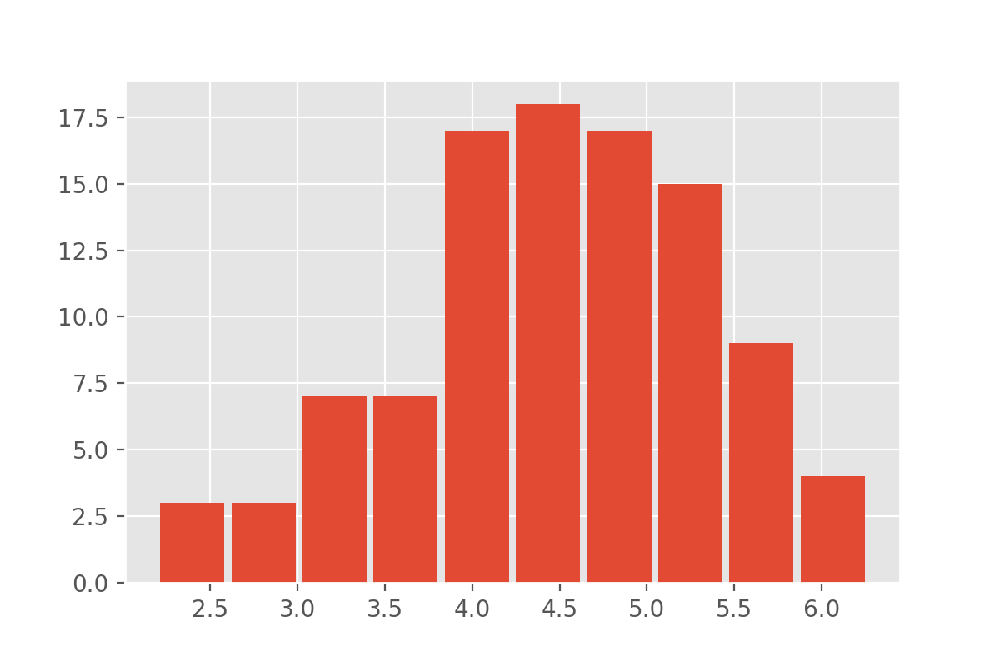

## Optional part - prediction uncertainty using Monte-Carlo Dropout
Depending on the data and the question asked, model predictions can be highly accuracte. Or, as in the present case, show a high degree of error.
In both cases, however, it often is highly relevant to not get model predictions but also an estimate of how reliable those predictions are.
The last years, this has been a very dynamic, rapidly growing area and there are many different ways to do uncertainty evaluation in deep learning.
Here we want to present a very versatile and easy-to-implement method: **Monte-Carlo Dropout** (original reference: https://arxiv.org/abs/1506.02142).

Above we have used dropout to randomly turn off network nodes during training.
When doing predictions, dropout is automatically deactivated and all nodes stay active.
Each time you run the same input data through the same trained model, the prediciton will be exactly the same.

Monte-Carlo Dropout relies on a simply change: dropout will remain active during prediction!
This means that each time a prediction step is done, the model will look differently because a fraction of all nodes will be turned off randomly.
One can interpret all of those random variations as individual models. 
Monte-Carlo Dropout now makes use of this fact and collects many different predictions instead of only one.
At the end this collection of predictions can be combined to a mean (or a median) prediction. 
And the variation of all predictions can tell something about the model's uncertainty.

A simple (and a bit hacky) way to enforce dropout layers to remain active is to add `training=True` to the model:
~~~
def create_nn(n_features, n_predictions):
    # Input layer
    layers_input = keras.layers.Input(shape=(n_features,), name='input')

    # Dense layers
    layers_dense = keras.layers.BatchNormalization()(layers_input)
    layers_dense = keras.layers.Dense(100, 'relu')(layers_dense)
    layers_dense = keras.layers.Dropout(rate=0.2)(layers_dense, training=True)
    layers_dense = keras.layers.Dense(50, 'relu')(layers_dense)
    layers_dense = keras.layers.Dropout(rate=0.2)(layers_dense, training=True)

    # Output layer
    layers_output = keras.layers.Dense(n_predictions)(layers_dense)

    # Defining the model and compiling it
    return keras.Model(inputs=layers_input, outputs=layers_output, name="model_monte_carlo_dropout")

model = create_nn(X_data.shape[1], 1)
model.compile(loss='mse', optimizer=Adam(1e-4), metrics=[keras.metrics.RootMeanSquaredError()])
~~~
{: .language-python} 

Model training remains entirely unchanged:
~~~
history = model.fit(X_train, y_train,
                    batch_size = 32,
                    epochs = 1000,
                    validation_data=(X_val, y_val),
                    callbacks=[earlystopper],
                    verbose = 2)
~~~
{: .language-python} 

But when now doing predictions, things will look different.
Let us do two predictions an compare the results.

~~~
y_test_predicted1 = model.predict(X_test)
y_test_predicted2 = model.predict(X_test)

y_test_predicted1[:10], y_test_predicted2[:10]
~~~
{: .language-python} 

This should give two arrays with different float numbers.

We can now compute predictions for a larger ensemble, say 100 random variations of the same model:
~~~
from tqdm.notebook import tqdm  # optional: to add progress bar

n_ensemble = 100
y_test_predicted_ensemble = np.zeros((X_test.shape[0], n_ensemble))

for i in tqdm(range(n_ensemble)):  # or: for i in range(n_ensemble):
    y_test_predicted_ensemble[:, i] = model.predict(X_test)[:,0]
~~~
{: .language-python} 

This will give an array of predictions, 100 different predictions for each datapoint in `X_test`.
We can inspect an example distribution, for instance by plotting a histrogram:

~~~
plt.hist(y_test_predicted_ensemble[0,:], rwidth=0.9)
plt.xlabel("predicted sunshine hours")
~~~
{: .language-python} 

Instead of full distributions for every datapoint we might also just want to extract the mean and standard deviation.
~~~
y_test_predicted_mean = np.mean(y_test_predicted_ensemble, axis=1)
y_test_predicted_std = np.std(y_test_predicted_ensemble, axis=1)
~~~
{: .language-python} 

This can then be plotted again as a scatter plot, but now with added information on the model uncertainty.
~~~
plt.figure(figsize=(5, 5), dpi=100)
plt.scatter(y_test_predicted_mean, y_test, s=40*y_test_predicted_std, 
            c=y_test_predicted_std, alpha=0.5)
plt.xlabel("predicted")
plt.ylabel("true values")
~~~
{: .language-python} 

