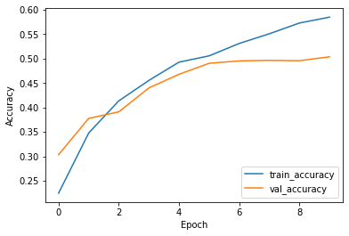
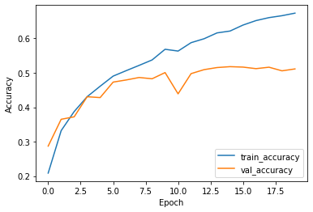
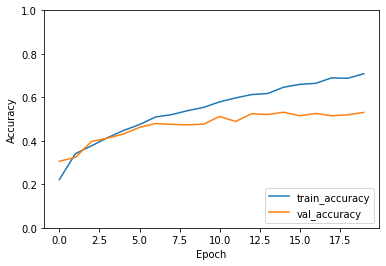

## Different types of layers
Networks are like onions: a typical neural network consists of many layers. In fact, the word *deep* in *Deep Learning*
refers to the many layers that make the network deep.

So far, we have seen one type of layer, namely the **fully connected**, or **dense** layer. This layer is called fully connected, because all input neurons are taken into account by each output neuron. The number of parameters that need to be learned by the network, is thus in the order of magnitude of the number of input neurons times the number of hidden neurons.

However, there are many different types of layers that perform different calculations and take different inputs. In this episode we will take a look at **convolutional layers** and **dropout layers**, which are useful in the context of image data, but also in many other types of (structured) data.

## Image classification
Keras comes with a few prepared datasets. We have a look at the [CIFAR10 dataset](https://www.cs.toronto.edu/~kriz/cifar.html),
which is a widely known dataset for image classification.
~~~
from tensorflow import keras
(train_images, train_labels), (test_images, test_labels) = keras.datasets.cifar10.load_data()
~~~
{: .language-python}

> ## CIFAR-10
>
> The CIFAR-10 dataset consists of images of 10 different classes: airplanes, cars, birds, cats, deer, dogs, frogs, horses, ships, and trucks.
> It is widely used as a benchmark dataset for image classification. The low resolution of the images in the dataset allows for quick loading and testing models.
>
> For more information about this dataset and how it was collected you can check out 
> [Learning Multiple Layers of Features from Tiny Images by  Alex Krizhevsky, 2009](https://www.cs.toronto.edu/~kriz/learning-features-2009-TR.pdf).
>
{: .callout}

We take a small sample of the data as training set for demonstration purposes.
~~~
n = 5000
train_images = train_images[:n]
train_labels = train_labels[:n]
~~~
{: .language-python}

> ## Explore the data
>
> Familiarize yourself with the CIFAR10 dataset. To start, consider the following questions:
> - What is the dimension of a single data point? What do you think the dimensions mean?
> - What is the range of values that your input data takes?
> - What is the shape of the labels, and how many labels do we have?
>
> > ## Solution
> >
> > To explore the dimensions of the input data:
> > ~~~
> > train_images.shape
> > ~~~
> > {: .language-python}
> > ~~~
> > (5000, 32, 32, 3)
> > ~~~
> > {: .output}
> > The first value, `5000`, is the number of training images that we have selected.
> > The remainder of the shape, namely `32, 32, 3)`, denotes
> > the dimension of one image. The last value 3 is typical for color images,
> > and stands for the three color channels **R**ed, **G**reen, **B**lue.
> > We are left with `32, 32`. This denotes the width and height of our input image in number of pixels. By convention, the first entry refers to the height, the second to the width of the image. In this case, we observe a quadratic image where height equals width.
> >
> > We can find out the range of values of our input data as follows:
> > ~~~
> > train_images.min(), train_images.max()
> > ~~~
> > {: .language-python}
> > ~~~
> > (0, 255)
> > ~~~
> > {: .output}
> > So the values of the three channels range between `0` and `255`.
> >
> > Lastly, we inspect the dimension of the labels:
> > ~~~
> > train_labels.shape
> > ~~~
> > {: .language-python}
> > ~~~
> > (5000, 1)
> > ~~~
> > {: .output}
> > So we have, for each image, a single value denoting the label.
> > To find out what the possible values of these labels are:
> > ~~~
> > train_labels.min(), train_labels.max()
> > ~~~
> > {: .language-python}
> > ~~~
> > (0, 9)
> > ~~~
> > {: .output}
> > The values of the labels range between `0` and `9`, denoting 10 different classes.
> {: .solution}
{: .challenge}

The training set consists of 50000 images of `32x32` pixels and 3 channels (RGB values). The RGB values are between `0` and `255`. For input of neural networks, it is better to have small input values. So we normalize our data between `0` and `1`:

~~~
train_images = train_images / 255.0
test_images = test_images / 255.0
~~~
{: .language-python}

The labels are single numbers denoting the class.
We map the class numbers back to the class names, taken from the documentation:

~~~
class_names = ['airplane', 'automobile', 'bird', 'cat', 'deer',
               'dog', 'frog', 'horse', 'ship', 'truck']
~~~
{: .language-python}

Now we can plot a sample of the training images, using the `plt.imshow` function.
~~~
import matplotlib.pyplot as plt
plt.figure(figsize=(10,10))
for i in range(25):
    plt.subplot(5,5,i+1)
    plt.imshow(train_images[i], cmap=plt.cm.binary)
    plt.axis('off')
    plt.title(class_names[train_labels[i,0]])
plt.show()
~~~
{: .language-python}

## Convolutional layers
In the previous episodes, we used 'fully connected layers' , that connected all input values of a layer to all outputs of a layer. This results in many connections, and thus weights to be learned, in the network. Note that our input dimension is now quite high (even with small pictures of `32x32` pixels), we have:

~~~
dim = train_images.shape[1] * train_images.shape[2] * train_images.shape[3]
print(dim)
~~~
{: .language-python}
~~~
3072
~~~
{: .output}

> ## Number of parameters
>
> Suppose we create a single Dense (fully connected) layer with 100 hidden units that connect to the input pixels, how many parameters does this layer have?
>
> > ## Solution
> >
> > Each entry of the input dimensions, i.e. the `shape` of one single data point, is connected with 100 neurons of our hidden layer, and each of these neurons has a bias term associated to it. So we have `307300` parameters to learn.
> > ~~~
> > width, height = (32, 32)
> > n_hidden_neurons = 100
> > n_bias = 100
> > n_input_items = width * height * 3
> > n_parameters = (n_input_items * n_hidden_neurons) + n_bias
> > n_parameters
> > ~~~
> > {: .language-python}
> > ~~~
> > 307300
> > ~~~
> > {: .output}
> > We can also check this by building the layer in Keras:
> > ~~~
> > inputs = keras.Input(shape=dim)
> > outputs = keras.layers.Dense(100)(inputs)
> > model = keras.models.Model(inputs=inputs, outputs=outputs)
> > model.summary()
> > ~~~
> > {: .language-python}
> > ~~~
> >     Model: "model"
    _________________________________________________________________
    Layer (type)                 Output Shape              Param #
    =================================================================
    input_1 (InputLayer)         [(None, 3072)]            0
    _________________________________________________________________
    dense (Dense)                (None, 100)               307300
    =================================================================
    Total params: 307,300
    Trainable params: 307,300
    Non-trainable params: 0
    _________________________________________________________________
> > ~~~
> > {: .output}
> {: .solution}
{: .challenge}

We can decrease the number of units in our hidden layer, but this also decreases the number of patterns our network can remember. Moreover, if we increase the image size, the number of weights will 'explode', even though the task of recognizing large images is not necessarily more difficult than the task of recognizing small images.

The solution is that we make the network learn in a 'smart' way. The features that we learn should be similar both for small and large images, and similar features (e.g. edges, corners) can appear anywhere in the image (in mathematical terms: *translation invariant*). We do this by making use of a concepts from image processing that precede Deep Learning.

A **convolution matrix**, or **kernel**, is a matrix transformation that we 'slide' over the image to calculate features at each position of the image. For each pixel, we calculate the matrix product between the kernel and the pixel with its surroundings. A kernel is typically small, between 3x3 and 7x7 pixels. We can for example think of the 3x3 kernel:
~~~
[[-1, -1, -1],
 [0, 0, 0]
 [1, 1, 1]]
~~~
{: .output}
This kernel will give a high value to a pixel if it's on a horizontal border between dark and light areas.
Note that for RGB images, the kernel should also have a depth of 3.

In the following image, we see the effect of such a kernel on the values of a single-channel image. The red cell in the output matrix is the result of multiplying and summing the values of the red square in the input, and the kernel. Applying this kernel to a real image shows that it indeed detects horizontal edges.

In our **convolutional layer** our hidden units are a number of convolutional matrices (or kernels), where the values of the matrices are the weights that we learn in the training process. The output of a convolutional layer is an 'image' for each of the kernels, that gives the output of the kernel applied to each pixel.

> ## Border pixels
>
> What, do you think, happens to the border pixels when applying a convolution?
>
> > ## Solution
> >
> > There are different ways of dealing with border pixels.
> > You can ignore them, which means that your output image is slightly smaller then your input.
> > It is also possible to 'pad' the borders, e.g. with the same value or with zeros, so that the convolution can also be applied to the border pixels.
> > In that case, the output image will have the same size as the input image.
> {: .solution}
{: .challenge}

> ## Number of model parameters
>
> Suppose we apply a convolutional layer with 100 kernels of size 3 * 3 * 3 (the last dimension applies to the rgb channels) to our images of 32 * 32 * 3 pixels. How many parameters do we have? Assume, for simplicity, that the kernels do not use bias terms. Compare this to the answer of the previous exercise
>
> > ## Solution
> >
> > We have 100 matrices with 3 * 3 * 3 = 27 values each so that gives 27 * 100 = 2700 weights. This is a magnitude of 100 less than the fully connected layer with 100 units! Nevertheless, as we will see, convolutional networks work very well for image data. This illustrates the expressiveness of convolutional layers.
> {: .solution}
{: .challenge}

So let's look at a network with a few convolutional layers. We need to finish with a Dense layer to connect the output cells of the convolutional layer to the outputs for our classes.

~~~
inputs = keras.Input(shape=train_images.shape[1:])
x = keras.layers.Conv2D(32, (3, 3), activation='relu')(inputs)
x = keras.layers.Conv2D(32, (3, 3), activation='relu')(x)
x = keras.layers.Flatten()(x)
outputs = keras.layers.Dense(10)(x)

model = keras.Model(inputs=inputs, outputs=outputs, name="cifar_model_small")

model.summary()
~~~
{: .language-python}

> ## Convolutional Neural Network
>
> Inspect the network above:
> * What do you think is the function of the `Flatten` layer?
> * Which layer has the most parameters? Do you find this intuitive?
>
> > ## Solution
> >
> > * The Flatten layer converts the 28x28x32 output of the convolutional layer into a single one-dimensional vector, that can be used as input for a dense layer.
> > * The last dense layer has the most parameters. This layer connects every single output 'pixel' from the convolutional layer to the 10 output classes.
> >  That results in a large number of connections, so a large number of parameters. This undermines a bit the expressiveness of the convolutional layers, that have much fewer parameters.
> {: .solution}
{: .challenge}

Often in convolutional neural networks, the convolutional layers are intertwined with **Pooling layers**. As opposed to the convolutional layer, the pooling layer actually alters the dimensions of the image and reduces it by a scaling factor. It is basically decreasing the resolution of your picture. The rationale behind this is that higher layers of the network should focus on higher-level features of the image. By introducing a pooling layer, the subsequent convolutional layer has a broader 'view' on the original image.

Let's put it into practice. We compose a Convolutional network with two convolutional layers and two pooling layers.

~~~
inputs = keras.Input(shape=train_images.shape[1:])
x = keras.layers.Conv2D(32, (3, 3), activation='relu')(inputs)
x = keras.layers.MaxPooling2D((2, 2))(x)
x = keras.layers.Conv2D(32, (3, 3), activation='relu')(x)
x = keras.layers.MaxPooling2D((2, 2))(x)
x = keras.layers.Flatten()(x)
x = keras.layers.Dense(32, activation='relu')(x)
outputs = keras.layers.Dense(10)(x)

model = keras.Model(inputs=inputs, outputs=outputs, name="cifar_model_small")

model.summary()
~~~
{: .language-python}
~~~
    Model: "cifar_model_small"
    _________________________________________________________________
    Layer (type)                 Output Shape              Param #
    =================================================================
    input_6 (InputLayer)         [(None, 32, 32, 3)]       0
    _________________________________________________________________
    conv2d_3 (Conv2D)            (None, 30, 30, 32)        896
    _________________________________________________________________
    max_pooling2d (MaxPooling2D) (None, 15, 15, 32)        0
    _________________________________________________________________
    conv2d_4 (Conv2D)            (None, 13, 13, 32)        9248
    _________________________________________________________________
    max_pooling2d_1 (MaxPooling2 (None, 6, 6, 32)          0
    _________________________________________________________________
    flatten (Flatten)            (None, 1152)              0
    _________________________________________________________________
    dense_1 (Dense)              (None, 32)                36896
    _________________________________________________________________
    dense_2 (Dense)              (None, 10)                330
    =================================================================
    Total params: 47,370
    Trainable params: 47,370
    Non-trainable params: 0
    _________________________________________________________________
~~~
{: .output}

We compile the model using the adam optimizer (other optimizers could also be used here!). Similar to the penguin classification task, we will use the crossentropy function to calculate the model's loss. This loss function is appropriate to use when the data has two or more label classes. 

To calculate crossentropy loss for data that has its classes represented by integers (i.e., not one-hot encoded), we use the SparseCategoricalCrossentropy() function:
~~~
model.compile(optimizer='adam',
              loss=keras.losses.SparseCategoricalCrossentropy(from_logits=True),
              metrics=['accuracy'])
~~~
{: .language-python}

We then train the model for 10 epochs:

~~~
history = model.fit(train_images, train_labels, epochs=10,
                    validation_data=(test_images, test_labels))
~~~
{: .language-python}

We can plot the training process using the history:

~~~
import seaborn as sns
import pandas as pd

history_df = pd.DataFrame.from_dict(history.history)
sns.lineplot(data=history_df[['accuracy', 'val_accuracy']])
~~~
{: .language-python}

~~~
sns.lineplot(data=history_df[['loss', 'val_loss']])
~~~
{: .language-python}

It seems that the model is overfitting somewhat, because the validation accuracy and loss stagnates.

> ## Network depth
>
> What, do you think, will be the effect of adding a convolutional layer to your model? Will this model have more or fewer parameters?
> Try it out. Create a `model` that has an additional `Conv2d` layer with 32 filters after the last MaxPooling2D layer. Train it for 20 epochs and plot the results.
>
> **HINT**:
> The model definition that we used previously needs to be adjusted as follows:
> ~~~
> inputs = keras.Input(shape=train_images.shape[1:])
> x = keras.layers.Conv2D(32, (3, 3), activation='relu')(inputs)
> x = keras.layers.MaxPooling2D((2, 2))(x)
> x = keras.layers.Conv2D(32, (3, 3), activation='relu')(x)
> x = keras.layers.MaxPooling2D((2, 2))(x)
> # Add your extra layer here
> x = keras.layers.Flatten()(x)
> x = keras.layers.Dense(32, activation='relu')(x)
> outputs = keras.layers.Dense(10)(x)
> ~~~
> {: language-python}
> >
> > ## Solution
> > We add an extra Conv2D layer after the second pooling layer:
> > ~~~
> > inputs = keras.Input(shape=train_images.shape[1:])
> > x = keras.layers.Conv2D(32, (3, 3), activation='relu')(inputs)
> > x = keras.layers.MaxPooling2D((2, 2))(x)
> > x = keras.layers.Conv2D(32, (3, 3), activation='relu')(x)
> > x = keras.layers.MaxPooling2D((2, 2))(x)
> > x = keras.layers.Conv2D(32, (3, 3), activation='relu')(x)
> > x = keras.layers.Flatten()(x)
> > x = keras.layers.Dense(32, activation='relu')(x)
> > outputs = keras.layers.Dense(10)(x)
> >
> > model = keras.Model(inputs=inputs, outputs=outputs, name="cifar_model")
> > ~~~
> > {: .output}
> > With the model defined above, we can inspect the number of parameters:
> > ~~~
> > model.summary()
> > ~~~
> > {: .language-python}
> > ~~~
> > Model: "cifar_model"
    _________________________________________________________________
    Layer (type)                 Output Shape              Param #
    =================================================================
    input_4 (InputLayer)         [(None, 32, 32, 3)]       0
    _________________________________________________________________
    conv2d_6 (Conv2D)            (None, 30, 30, 32)        896
    _________________________________________________________________
    max_pooling2d_4 (MaxPooling2 (None, 15, 15, 32)        0
    _________________________________________________________________
    conv2d_7 (Conv2D)            (None, 13, 13, 32)        9248
    _________________________________________________________________
    max_pooling2d_5 (MaxPooling2 (None, 6, 6, 32)          0
    _________________________________________________________________
    conv2d_8 (Conv2D)            (None, 4, 4, 32)          9248
    _________________________________________________________________
    flatten_3 (Flatten)          (None, 512)               0
    _________________________________________________________________
    dense_6 (Dense)              (None, 32)                16416
    _________________________________________________________________
    dense_7 (Dense)              (None, 10)                330
    =================================================================
    Total params: 36,138
    Trainable params: 36,138
    Non-trainable params: 0
    _________________________________________________________________
> > ~~~
> > {: .output}
> > The number of parameters has decreased by adding this layer.
> > We can see that the conv layer decreases the resolution from 6x6 to 4x4,
> > as a result, the input of the Dense layer is smaller than in the previous network.
> >
> > To train the network and plot the results:
> > ~~~
> > model.compile(optimizer='adam',
> >               loss=keras.losses.SparseCategoricalCrossentropy(from_logits=True),
> >               metrics=['accuracy'])
> >
> > history = model.fit(train_images, train_labels, epochs=20,
> >                     validation_data=(test_images, test_labels))
> >
> > history_df = pd.DataFrame.from_dict(history.history)
> > sns.lineplot(data=history_df[['accuracy', 'val_accuracy']])
> >
> > ~~~
> > {: .language-python}
> > 
> > ~~~
> > sns.lineplot(data=history_df[['loss', 'val_loss']])
> > ~~~
> > {: .language-python}
> > 
> {: .solution}
{: .challenge}

> ## Other types of data
>
> Convolutional and Pooling layers are also applicable to different types of
> data than image data. Whenever the data is ordered in a (spatial) dimension,
> and *translation invariant* features are expected to be useful, convolutions
> can be used. Think for example of time series data from an accelerometer,
> audio data for speech recognition, or 3d structures of chemical compounds.
>
{: .callout}

## Dropout

Note that the training loss continues to decrease, while the validation loss stagnates, and even starts to increase over the course of the epochs. Similarly, the accuracy for the validation set does not improve anymore after some epochs. This means we are overfitting on our training data set.

Techniques to avoid overfitting, or to improve model generalization, are termed **regularization techniques**.
One of the most versatile regularization technique is **dropout** ([Srivastava et al., 2014](https://jmlr.org/papers/v15/srivastava14a.html)).
Dropout essentially means that during each training cycle a random fraction of the dense layer nodes are turned off. This is described with the dropout rate between 0 and 1 which determines the fraction of nodes to silence at a time.

The intuition behind dropout is that it enforces redundancies in the network by constantly removing different elements of a network. The model can no longer rely on individual nodes and instead must create multiple "paths". In addition, the model has to make predictions with much fewer nodes and weights (connections between the nodes).
As a result, it becomes much harder for a network to memorize particular features. At first this might appear a quiet drastic approach which affects the network architecture strongly.
In practice, however, dropout is computationally a very elegant solution which does not affect training speed. And it frequently works very well.

**Important to note:** Dropout layers will only randomly silence nodes during training! During a predictions step, all nodes remain active (dropout is off). During training, the sample of nodes that are silenced are different for each training instance, to give all nodes a chance to observe enough training data to learn its weights.

Let's add one dropout layer towards the end of the network, that randomly drops 20% of the input units.

~~~
inputs = keras.Input(shape=train_images.shape[1:])
x = keras.layers.Conv2D(32, (3, 3), activation='relu')(inputs)
x = keras.layers.MaxPooling2D((2, 2))(x)
x = keras.layers.Conv2D(32, (3, 3), activation='relu')(x)
x = keras.layers.MaxPooling2D((2, 2))(x)
x = keras.layers.Conv2D(32, (3, 3), activation='relu')(x)
x = keras.layers.Dropout(0.2)(x) # This is new!
x = keras.layers.Flatten()(x)
x = keras.layers.Dense(32, activation='relu')(x)
outputs = keras.layers.Dense(10)(x)

model_dropout = keras.Model(inputs=inputs, outputs=outputs, name="cifar_model")

model_dropout.summary()
~~~
{: .language-python}
~~~
    Model: "cifar_model"
    _________________________________________________________________
    Layer (type)                 Output Shape              Param #
    =================================================================
    input_5 (InputLayer)         [(None, 32, 32, 3)]       0
    _________________________________________________________________
    conv2d_9 (Conv2D)            (None, 30, 30, 32)        896
    _________________________________________________________________
    max_pooling2d_6 (MaxPooling2 (None, 15, 15, 32)        0
    _________________________________________________________________
    conv2d_10 (Conv2D)           (None, 13, 13, 32)        9248
    _________________________________________________________________
    max_pooling2d_7 (MaxPooling2 (None, 6, 6, 32)          0
    _________________________________________________________________
    conv2d_11 (Conv2D)           (None, 4, 4, 32)          9248
    _________________________________________________________________
    dropout (Dropout)            (None, 4, 4, 32)          0
    _________________________________________________________________
    flatten_4 (Flatten)          (None, 512)               0
    _________________________________________________________________
    dense_8 (Dense)              (None, 32)                16416
    _________________________________________________________________
    dense_9 (Dense)              (None, 10)                330
    =================================================================
    Total params: 36,138
    Trainable params: 36,138
    Non-trainable params: 0
    _________________________________________________________________

~~~
{: .output}
We can see that the dropout does note alter the dimensions of the image, and has zero parameters.

We again compile and train the model.
~~~
model_dropout.compile(optimizer='adam',
              loss=keras.losses.SparseCategoricalCrossentropy(from_logits=True),
              metrics=['accuracy'])

history_dropout = model_dropout.fit(train_images, train_labels, epochs=20,
                    validation_data=(test_images, test_labels))
~~~
{: .language-python}

And inspect the training results:
~~~
history_df = pd.DataFrame.from_dict(history_dropout.history)
history_df['epoch'] = range(1,len(history_df)+1)
history_df = history_df.set_index('epoch')
sns.lineplot(data=history_df[['accuracy', 'val_accuracy']])

test_loss, test_acc = model_dropout.evaluate(test_images,  test_labels, verbose=2)
~~~
{: .language-python}
~~~
    313/313 - 2s - loss: 1.4683 - accuracy: 0.5307
~~~
{: .output}

~~~
sns.lineplot(data=history_df[['loss', 'val_loss']])
~~~
{: .language-python}

Now we see that the gap between the training accuracy and validation accuracy is much smaller, and that the final accuracy on the validation set is higher than without dropout.
Nevertheless, there is still some difference between the training loss and validation loss, so we could experiment with regularization even more.


