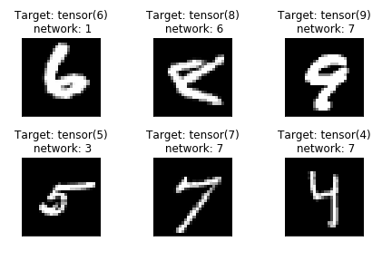

# Prepare your Data

Let's use the [MNIST dataset](http://yann.lecun.com/exdb/mnist/), a database of handwritten digits.
The digits have been size-normalized and centered in a fixed-size image:

It is a good database for people who want to try learning techniques and pattern recognition methods on real-world data while spending minimal efforts on preprocessing and formatting.

## Normalisation

The learning problem for neural networks is sensitive to input scaling (Hastie et.al., 2009). Scaling the inputs determines the effective scaling of the weights and can have a large effect on the quality of the final solution. There are two usual ways: min-max scaling and standardisation. It is mostly recommended to standardise the inputs to have mean zero and standard deviation one. Then, all inputs are treated equally in the regularisation process.
Scikit-learn has a function to standardise. 

~~~
from sklearn import preprocessing
import numpy as np
X_train = np.array([[ 1., -1.,  2.], [ 2.,  0.,  0.],[ 0.,  1., -1.]])
X_scaled = preprocessing.scale(X_train)
print(X_scaled)
print(X_scaled.mean(axis=0))
print( X_scaled.std(axis=0))
~~~
{: .language-python}

We will see later that we can also use pyTorch for normalizing our data.

## Training data versus Test data

To validate our model, it is good practice to split the sample dataset in two:

- training dataset
- test dataset

There are different technique to split a dataset from the simplest (taking the first half as the training dataset and the second half as the testing dataset) to the most sophisticated. High-level machine learning libraries usually offer ready-made functions to split training and test datasets. 

After downloading or collecting our data, we wish to split the dataset into a training and a test set. The training set is to be used to build the model and calculate its parameters. A very common way of splitting the dataset is with `sklearn.model_selection.train_test_split`, in which the dataset is the first input and the size of the training set/test set is specified.

~~~
import numpy as np
import sklearn
np.random.seed(1)
X, y = sklearn.datasets.fetch_openml('mnist_784', version=1, return_X_y=True)
X_train, X_test, y_train, y_test = sklearn.model_selection.train_test_split(X, y, test_size=0.3)
~~~
{: .language-python}

The MNIST database is already providing us with one training dataset and one test dataset. Therefore there is no need to split our input data.

# Load your data

Let's download the MNIST dataset with PyTorch. We define sizes of the training and test batches. Loading this dataset from torchvision, it is possible to normalise it with the *torchvision.transforms.Normalize* by giving the mean (0.1307) and the standard deviation (0.3081) of the dataset. 
It is necessary to set a seed when dealing with random numbers.

- Download and load the MNIST training dataset with PyTorch:

~~~
import torch
import torchvision

import torch.nn

torch.random.manual_seed(1)

batch_size_train = 64

train_loader = torch.utils.data.DataLoader(torchvision.datasets.MNIST(root='./data/', train=True, download=True,
                             transform=torchvision.transforms.Compose([
                               torchvision.transforms.ToTensor(),
                               torchvision.transforms.Normalize(
                                 (0.1307,), (0.3081,))
                             ])),
  batch_size=batch_size_train, shuffle=True)

print(train_loader.dataset)  
~~~
{: .language-python}

~~~
Dataset MNIST
    Number of datapoints: 60000
    Split: train
    Root Location: ./data/
    Transforms (if any): Compose(
                             ToTensor()
                             Normalize(mean=(0.1307,), std=(0.3081,))
                         )
    Target Transforms (if any): None
~~~
{: .output}

To get the first image from the torchvision object:

~~~
train_loader.dataset.train_data.numpy()[0]
~~~
{: .language-python}

The the shape of this image is 28 x 28:

~~~
train_loader.dataset.train_data.numpy()[0].shape
~~~
{: .language-python}

Let's plot our first number:

import matplotlib.pyplot as plt
%matplotlib inline
# index 0 is there because we look at the first image
image = train_loader.dataset.train_data.numpy()[0]
label = train_loader.dataset.train_labels.numpy()[0]
plt.imshow(image,cmap='gray')
plt.title("Target: {}".format(label));

- Download and load the MNIST test dataset with PyTorch:

~~~
batch_size_test = 1000
test_loader = torch.utils.data.DataLoader(
  torchvision.datasets.MNIST('./data/', train=False, download=True,
                             transform=torchvision.transforms.Compose([
                               torchvision.transforms.ToTensor(),
                               torchvision.transforms.Normalize(
                                 (0.1307,), (0.3081,))
                             ])),
  batch_size=batch_size_test, shuffle=True)
  
print(test_loader.dataset)  
~~~
{: .language-python}

~~~
Dataset MNIST
    Number of datapoints: 10000
    Split: test
    Root Location: ./data/
    Transforms (if any): Compose(
                             ToTensor()
                             Normalize(mean=(0.1307,), std=(0.3081,))
                         )
    Target Transforms (if any): None  
~~~
{: .output}

Let's see how the data looks like and plot some images from our dataset.
~~~
import matplotlib.pyplot as plt
%matplotlib inline
examples = enumerate(train_loader)
batch_idx, (example_data, example_targets) = next(examples)
image = example_data[1][0]
mean = 0.1307
std = 0.3081
image = ((mean * image) + std)
plt.imshow(image,cmap='gray')
plt.title("Target: {}".format(example_targets[1]));
~~~
{: .language-python}

# Define your network

In PyTorch, the neural networks are built as classes. The last layer should have an output dimension equal to the number of classes in the classification problem. The first layer has an input size equal to the dimension of the input. 
In the forward function, the input is passed through the layers and the output is returned.

Generally it is better to have too many hidden units in a neural network. With too few hidden units, the model might not be flexible enough to represent the nonlinearities in the data; with too many, the extra weights can tend to zero if appropiate regularisation if used. The use of multiple hidden layers allows for the construction of hierarchical features at different levels of resolution (Hastie et.al., 2009).

In the training phase, the weights and biases are calculated. The loss is calculated with the criterion and backpropagated to change the parameters.

~~~
class ANN(torch.nn.Module):
    def __init__(self):
        super().__init__()
        self.fc1 = torch.nn.Linear(28*28, 30)   #input size
        self.fc2 = torch.nn.Linear(30, 30)
        self.fc3 = torch.nn.Linear(30, 30)
        self.fc4 = torch.nn.Linear(30, 10)

    def forward(self, x):
        x = x.view(x.size(0), -1)   # the size -1 is inferred from other dimensions (28*28)
        x = torch.sigmoid(self.fc1(x))
        x = torch.sigmoid(self.fc2(x))
        x = torch.sigmoid(self.fc3(x))
        x = self.fc4(x)
        return x     
~~~
{: .language-python}

# Define cost function and optimizer

First, the network class is initialised. Then, we choose an optimiser and a learning rate for the optimisation. In order to update our learning rate, we can use a scheduler to reduce the learning rate. The `torch.optim.lr_scheduler.ReduceLROnPlateau` reduces the learning rate when a chosen metric has stopped improving after some epochs. In `mode='min'`, the learning rate will be reduced when the quantity monitored has stopped decreasing.
The criterion usually used for training a classification problem is the Cross Entropy loss `torch.nn.CrossEntropyLoss()`.  

Due to the high amount of parameters in such models, overfitting can be an issue. In order to avoid overfitting, a penalty term is added to the error function multiplied by a tuning parameter, the so-called *weight decay*, which is greater or equal than zero. Larger values of the weight decay will shrink the weights toward zero. 

~~~
network = ANN()
learning_rate = 0.0001
optimiser = torch.optim.Adam(network.parameters(), lr=learning_rate,
                      weight_decay=0.005) 
scheduler = torch.optim.lr_scheduler.ReduceLROnPlateau(optimiser,mode='min')
criterion = torch.nn.CrossEntropyLoss() 
~~~
{: .language-python}

# Training phase algorithm

~~~
def training_phase(ann, epoch, train_loader):
        ann.train()
        train_loss = 0
        train_corrects = 0
        for batch_idx, (data, target) in enumerate(train_loader):
            optimiser.zero_grad()
            output = ann.forward(data)
            _, preds = torch.max(output.data, 1)
            loss = criterion(output, target)
            loss.backward()
            optimiser.step()
            train_loss += loss.item()
            train_corrects += torch.sum(preds == target.data) 

        epoch_acc= train_corrects.double() / len(train_loader.dataset)
        print('Epoch {} , Average training loss is {:.6f} and accuracy is {}/{} {:.0f}%'.format((epoch+1),
                        train_loss/len(train_loader),train_corrects.double(),
                                        len(train_loader.dataset),epoch_acc*100.))
        
  
~~~
{: .language-python}

`torch.max` is a PyTorch function that returns two outputs:
- the maximum value of the tensor passed in parameter
- the index of the maximum value of the tensor

In our case, the index corresponds to our class i.e. the digit number.

# Testing phase algorithm

~~~
def testing_phase(ann, test_loader):
        ann.eval()
        test_loss = 0
        test_corrects = 0
        total= 0
        with torch.no_grad():
            for batch_idx,(data, target) in enumerate(test_loader):
                output = ann.forward(data)
                _, preds = torch.max(output.data, 1)
                test_loss += criterion(output, target).item()
                total += target.size(0)
                test_corrects += torch.sum(preds == target.data) 
        
            epoch_acc= test_corrects.double() / len(test_loader.dataset)
            test_loss /= len(test_loader)
       
            print('\nTest set: Avg. loss: {:.4f}, Accuracy: {}/{} ({:.0f}%)\n'.format(
                test_loss, test_corrects, len(test_loader.dataset),
                100. * epoch_acc))
            scheduler.step(test_loss) 
~~~
{: .language-python}

# Run train and test for network

~~~
n_epochs = 15
test_counter = [i*len(train_loader.dataset) for i in range(n_epochs + 1)]
testing_phase(network, test_loader)
for epoch in range(n_epochs):
    training_phase(network, epoch, train_loader)
    testing_phase(network, test_loader)
~~~
{: .language-python}

To check the final parameters of the model in each layer, we should call the network parameters. Here the weights in the first layer are presented.
~~~
network.fc1.weight
~~~
{: .language-python}

And the biases:
~~~
network.fc1.bias
~~~
{: .language-python}

We can also make a few plots:

~~~
import matplotlib.pyplot as plt
%matplotlib inline

examples = enumerate(train_loader)
batch_idx, (example_data, example_targets) = next(examples)
example_data.shape

with torch.no_grad():
    example_network = network(example_data)   
    _, example_pred = torch.max(example_network.data, 1)

fig = plt.figure()
for i in range(6):
  plt.subplot(2,3,i+1)
  plt.tight_layout()
  plt.imshow(example_data[i][0], cmap='gray', interpolation='none')
  plt.title("Target: " + str(example_targets[i]) + "\n network: " + str(example_pred.numpy()[i]) )
  plt.xticks([])
  plt.yticks([])
~~~
{: .language-python}

> ## Challenge
>
> - What do you think about the performance of our neural network? Is it acceptable?
> - Suggest changes to improve the overall performance (for instance, increase the number of epochs, the learning rate, the number of hidden cells, etc.
> - Can you manage to tune your neural network to overfit your data?
> Does it help to add a new hidden layer?
>
{: .language-python}

# How to save/load your neural network?

## Saving your neural network state

The learning phase is often long (computationally intensive) and once your neural network has finished its training phase, you would like to save its state and run it in"forward" mode only. 

To save the network parameters (weights and biases):

~~~
torch.save(network.state_dict(), 'model.pth')
~~~
{: .language-python}

You can also save the state of your optimizer:

~~~
torch.save(optimiser.state_dict(), 'optimiser.pth')
~~~
{: .language-python}

## Load neural network state

You can now use your neural network in some kind of "operational mode" where the learning phase will never be run again:

~~~

class ANN(torch.nn.Module):
    def __init__(self):
        super().__init__()
        self.fc1 = torch.nn.Linear(28*28, 30)   #input size
        self.fc2 = torch.nn.Linear(30, 30)
        self.fc3 = torch.nn.Linear(30, 30)
        self.fc4 = torch.nn.Linear(30, 10)

    def forward(self, x):
        x = x.view(x.size(0), -1)   # the size -1 is inferred from other dimensions (28*28)
        x = torch.sigmoid(self.fc1(x))
        x = torch.sigmoid(self.fc2(x))
        x = torch.sigmoid(self.fc3(x))
        x = self.fc4(x)
        return x     
        
model = ANN()
model.load_state_dict(torch.load('model.pth'))
model.eval()
~~~
{: .language-python}

See more [here](https://pytorch.org/tutorials/beginner/saving_loading_models.html#what-is-a-state-dict).

# References
Hastie, T., Tibshirani, R., Friedman, J. , The Elements of Statistical Learning, Springer, 2009.



