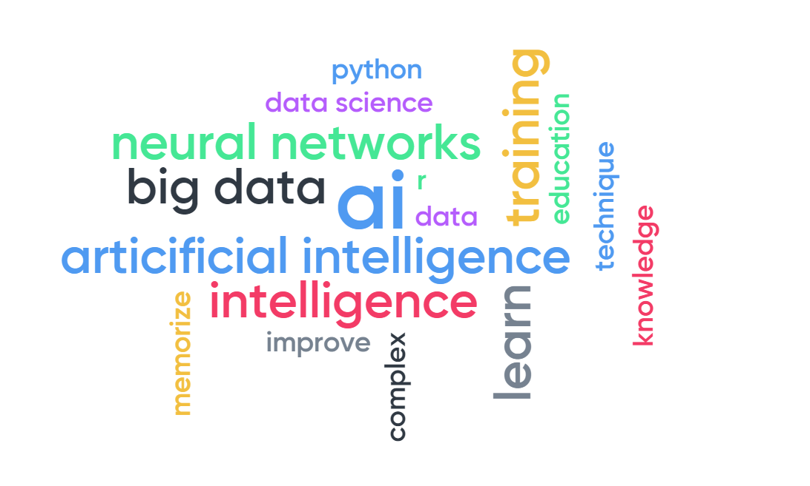
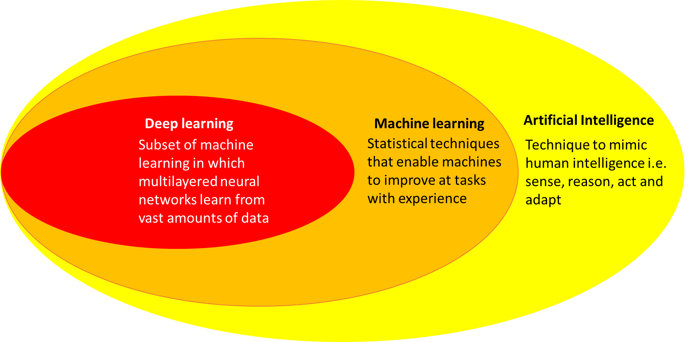
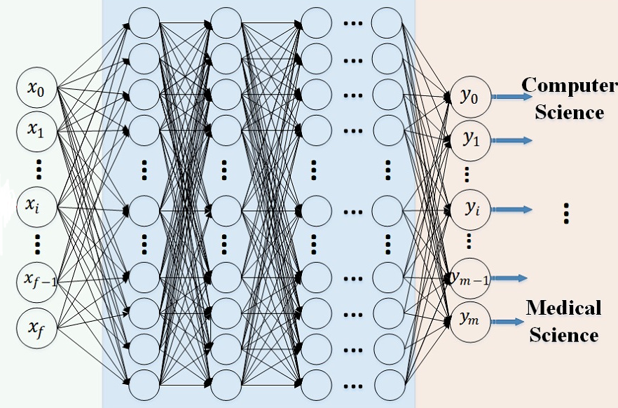
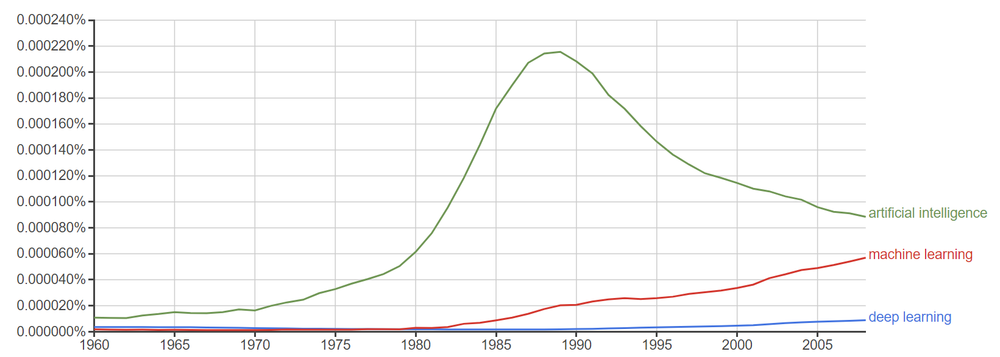
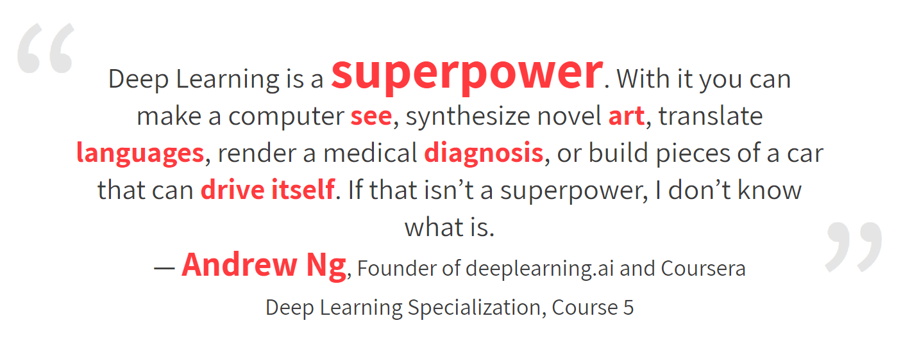
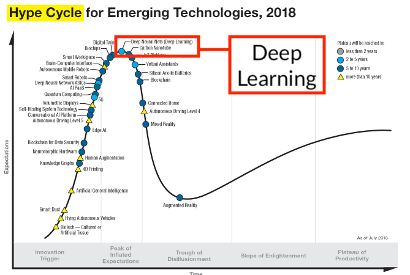

class: center, middle

# What is deep learning?

## Anne Fouilloux, Ana Costa Conrado and Jean Iaquinta 

Department of Geosciences

University of Oslo, Norway

---

layout: true

.header-content[&nbsp;Research Bazaar 2019 - Learn deep learning with Python]

  

    &nbsp; 
    &nbsp; Research Bazaar 2019
  

---
&nbsp;

# Welcome!

The easiest way to navigate this slide deck is by hitting [space] on your keyboard

You can also navigate with arrow keys, but be careful because some slides can be nested inside of each other (vertically)

---
&nbsp;

# Questions about deep-learning...

- What?
- Why?
- How?

---
&nbsp;

# What is deep learning?

Go to [www.menti.com](https://www.menti.com/) and use the code **64 74 68**

---
&nbsp;

## What is deep learning?

**Deep Learning = Large Neural Networks**

---
&nbsp;
# Large Neural Network

---
&nbsp;

# Interest in deep learning

*Source*: [Google Book NGram Viewer](https://books.google.com/ngrams/graph?content=deep+learning%2Cmachine+learning%2Cartificial+intelligence&year_start=1960&year_end=2019&corpus=15&smoothing=3&share=&direct_url=t1%3B%2Cdeep%20learning%3B%2Cc0%3B.t1%3B%2Cmachine%20learning%3B%2Cc0%3B.t1%3B%2Cartificial%20intelligence%3B%2Cc0)

---
&nbsp;

# Hype or reality?

---
&nbsp;

<i>source</i>: <b>gartner.com/SmarterWithGartner</b>, Gartner (August 2018), Copyright 2018 Gartner, Inc. and/or affiliates, All rights reserved.

---
&nbsp;

# Why deep learning?

<i>source</i>: <a href="https://www.slideshare.net/ExtractConf">Andrew Ng</a>, all rights reserved.

---
&nbsp;

# Applications of deep learning

Neural networks are universal approximators, and they work best if the system you are using them to model has a **high tolerance to error**. 

They work very well for:
- capturing associations or discovering regularities within a set of patterns;
- where the volume, number of variables or diversity of the data is very large;
- the relationships between variables are vaguely understood; or,
- the relationships are difficult to describe adequately with conventional approaches.

---
&nbsp;

# Examples

## Lip synchronization from audio

<iframe  style="display: block; margin: 0px auto;"  id="_ytid_32252" width="480" height="270"  src="https://www.youtube.com/embed/MVBe6_o4cMI?enablejsapi=1&autoplay=0&cc_load_policy=1&iv_load_policy=3&loop=0&modestbranding=1&rel=0&showinfo=1&fs=1&theme=dark&color=red&autohide=2&controls=2&playsinline=0&"  class="__youtube_prefs__" title="YouTube player"  allowfullscreen data-no-lazy="1" data-skipgform_ajax_framebjll=""></iframe>

Supasorn Suwajanakorn, Steven M. Seitz, and Ira Kemelmacher-Shlizerman. 2017. Synthesizing Obama: Learning Lip Sync from Audio. ACM Trans.
Graph. 36, 4, Article 95 (July 2017), 13 pages.
DOI: <a href=http://dx.doi.org/10.1145/3072959.3073640>10.1145/3072959.3073640</a> 

---
&nbsp;

# Examples

## Automatic image colorization

<iframe width="652" height="270" src="https://www.youtube.com/embed/ys5nMO4Q0iY" frameborder="0" allowfullscreen></iframe>
 

<a href="http://iizuka.cs.tsukuba.ac.jp/projects/colorization/en/">Satoshi Iizuka, Edgar Simo-Serra and Hiroshi Ishikawa, 2016. Let there be Color!: Joint End-to-end 
Learning of Global and Local Image Priors for Automatic Image Colorization with Simultaneous Classification, SIGGRAPH 2016</a>
. 

---
&nbsp;

# Examples

## Predicting Earthquakes

Phoebe R. DeVries, T. Ben Thompson, Brendan J. Meade, 2017. 
Enabling large-scale viscoelastic calculations via neural network acceleration, 
DOI: <a href="https://arxiv.org/abs/1701.08884">10.1002/2017GL072716</a>

**Deep Learning improved calculation time by 50,000%!**

---
&nbsp;

# Limitations

- deep neural networks are very often black-boxes:  the user has no other role than to feed it input and watch it train and await the output...
- The patterns extracted or strategies learnt by deep learning may be more superficial than they appear ("over-interpret")
- Deep learning learns complex correlations between input and output features with no inherent representation of causality
- Deep learning so far is limited in its ability to deal with hierarchical structure

See more at "[What are the main criticism and limitations of deep learning](https://www.quora.com/What-are-the-main-criticism-and-limitations-of-deep-learning)".

---
&nbsp;

# Our objectives

- Understand neural networks
- Get some insights on how to analyse data set
- Preprocess, clean data set for applying deep-learning
- Select training data set and test data set, validate the model
- How to select features for the neural network
- Understand output

---
&nbsp;

# References

- [What Data scientists should know about deep learning](https://www.slideshare.net/ExtractConf)
- [Deep Learning’s ‘Permanent Peak’ On Gartner’s Hype Cycle](https://medium.com/machine-learning-in-practice/deep-learnings-permanent-peak-on-gartner-s-hype-cycle-96157a1736e)
- [30 Amazing applications of Deep learning](http://www.yaronhadad.com/deep-learning-most-amazing-applications/)
- [What are the main criticism and limitations of deep learning](https://www.quora.com/What-are-the-main-criticism-and-limitations-of-deep-learning).
- [A basic introduction to Neural Networks](http://pages.cs.wisc.edu/~bolo/shipyard/neural/local.html)
